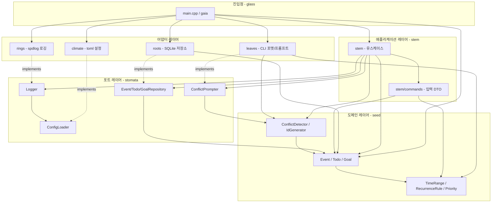

# Facet 1: 아키텍처/의존 — Terrarium CLI_Planning (C++)

## 개요

식물 메타포로 네이밍된 **헥사고날(포트-어댑터) 아키텍처**의 CLI 애플리케이션이다. 핵심 도메인/유스케이스(`planning_core`)가 인터페이스(`stomata` 포트)에만 의존하고, 구체 기술(SQLite, spdlog, toml++, CLI11)은 별도 어댑터 라이브러리로 분리되어 의존성이 안쪽으로만 향한다. 실행 파일 `gaia`(`src/glass/main.cpp`)가 유일한 컴포지션 루트로서 어댑터를 조립한다.

## 디렉토리/모듈 레이아웃

```
src/
├── glass/        # 진입점 (main.cpp) = Composition Root
├── stem/         # 유스케이스 (use cases / application layer)
│   ├── commands/ #   - 입력 DTO (Create/Update/Delete command 구조체)
│   └── queries/  #   - 조회 DTO (현재 비어 있음, 헤더 미존재)
├── seed/         # 도메인 엔티티 / 값객체 / 도메인 서비스
├── stomata/      # 포트 (추상 인터페이스: Repository, Logger, ConfigLoader, ConflictPrompter)
├── roots/        # 어댑터 - SQLite 저장소 + 마이그레이션 (SQLiteCpp)
├── rings/        # 어댑터 - 로깅 (spdlog)
├── climate/      # 어댑터 - 설정 로딩 (toml++)
└── leaves/       # 어댑터 - CLI 출력 포맷 / 충돌 프롬프트 (driving 측)
CMakeLists.txt    # 라이브러리/실행파일 타겟 정의
```

빌드 타겟은 모듈 경계와 1:1 대응한다: `planning_core`(seed+stem+stomata) / `planning_roots` / `planning_rings` / `planning_climate` / `planning_leaves` 어댑터 라이브러리, 그리고 실행 파일 `gaia`.

## 모듈별 역할

| 모듈(디렉토리) | 빌드 타겟 | 레이어 | 역할 |
|---|---|---|---|
| `glass` | `gaia` (exe) | 진입점 | `main()` 컴포지션 루트. CLI11 파싱, 어댑터 인스턴스화/주입, 유스케이스 실행 배선 |
| `stem` | `planning_core` | 유스케이스 | 도메인 작업 오케스트레이션 (Event/Todo/Goal의 Create·Update·Delete·List·Show, Dashboard). 포트에만 의존 |
| `stem/commands` | `planning_core` | 유스케이스 입력 | 유스케이스 입력 DTO 구조체 (EventCommands, TodoCommands, GoalCommands, DashboardCommands) |
| `seed` | `planning_core` | 도메인 | 엔티티(Event, Todo, Goal), 값객체(TimeRange, RecurrenceRule, Priority), 도메인 서비스(ConflictDetector), id 추상(IdGenerator)·구현(StdUuidGenerator) |
| `stomata` | `planning_core` (헤더) | 포트 | 추상 인터페이스: EventRepository, TodoRepository, GoalRepository, Logger, ConfigLoader, ConflictPrompter |
| `roots` | `planning_roots` | 어댑터(driven) | Sqlite{Event,Todo,Goal}Repository, MigrationRunner — SQLiteCpp 기반 영속화 |
| `rings` | `planning_rings` | 어댑터(driven) | SpdlogLogger — Logger 포트 구현 |
| `climate` | `planning_climate` | 어댑터(driven) | TomlConfigLoader(ConfigLoader 포트 구현), DefaultConfig |
| `leaves` | `planning_leaves` | 어댑터(driving 보조) | CliFormat(출력 렌더), CliConflictPrompter(ConflictPrompter 포트 구현) |

## 진입점

| 진입점 | 위치 | 설명 |
|---|---|---|
| `main()` | `src/glass/main.cpp` | 유일 실행 진입점. 모든 어댑터(roots/rings/climate/leaves)와 도메인/유스케이스(seed/stem)를 직접 include 하여 조립하는 컴포지션 루트. `gaia` 실행 파일로 빌드 |

`main.cpp`는 어댑터 5종, 도메인 헤더, 17개 유스케이스, 4개 command DTO를 모두 include 한다 — 의존성 조립이 한 곳에 집중된 전형적 컴포지션 루트 형태다.

## 내부 의존성 방향

핵심 규칙: 어댑터(roots/rings/climate/leaves)는 포트(`stomata`)를 **구현**하고, 유스케이스(`stem`)는 포트에만 의존한다. 따라서 도메인/유스케이스는 구체 기술을 모른다(의존성 역전). 진입점 `glass`만 어댑터와 코어를 동시에 알고 조립한다. **순환 의존 없음** — 모든 화살표가 진입점 -> 어댑터/유스케이스 -> 포트 -> 도메인 방향의 단방향이다.



## 관찰 메모

- **의존성 역전이 일관되게 적용됨**: 4개 어댑터가 각각 `stomata` 포트를 `implements` 하며, `stem` 유스케이스 헤더에는 구체 어댑터(`roots`/`rings`/`climate`) include 가 전혀 없다 — 포트(`stomata/*`)만 참조한다.
- **포트 라이브러리 분리 없음**: `stomata`/`seed`/`stem`이 모두 `planning_core` 한 타겟에 묶여 있다(헤더-only 포트 포함). 어댑터들은 `planning_core`에 PUBLIC 링크하고 외부 라이브러리는 PRIVATE 으로 캡슐화한다.
- **`stem/queries/` 디렉토리는 존재하나 비어 있음** (조회용 DTO 미구현, 현재 조회는 엔티티 직접 반환).
- 외부 헤더 `uuid.h`(stduuid)가 `seed`의 일부 엔티티 헤더에 직접 노출된다 — 도메인이 id 생성용 vendor 타입에 헤더 수준으로 의존하는 지점(facet 4 외부의존 상세 범위, 여기선 위치만 언급).

관련 경로: `src/`, `CMakeLists.txt`, 진입점 `src/glass/main.cpp`.
