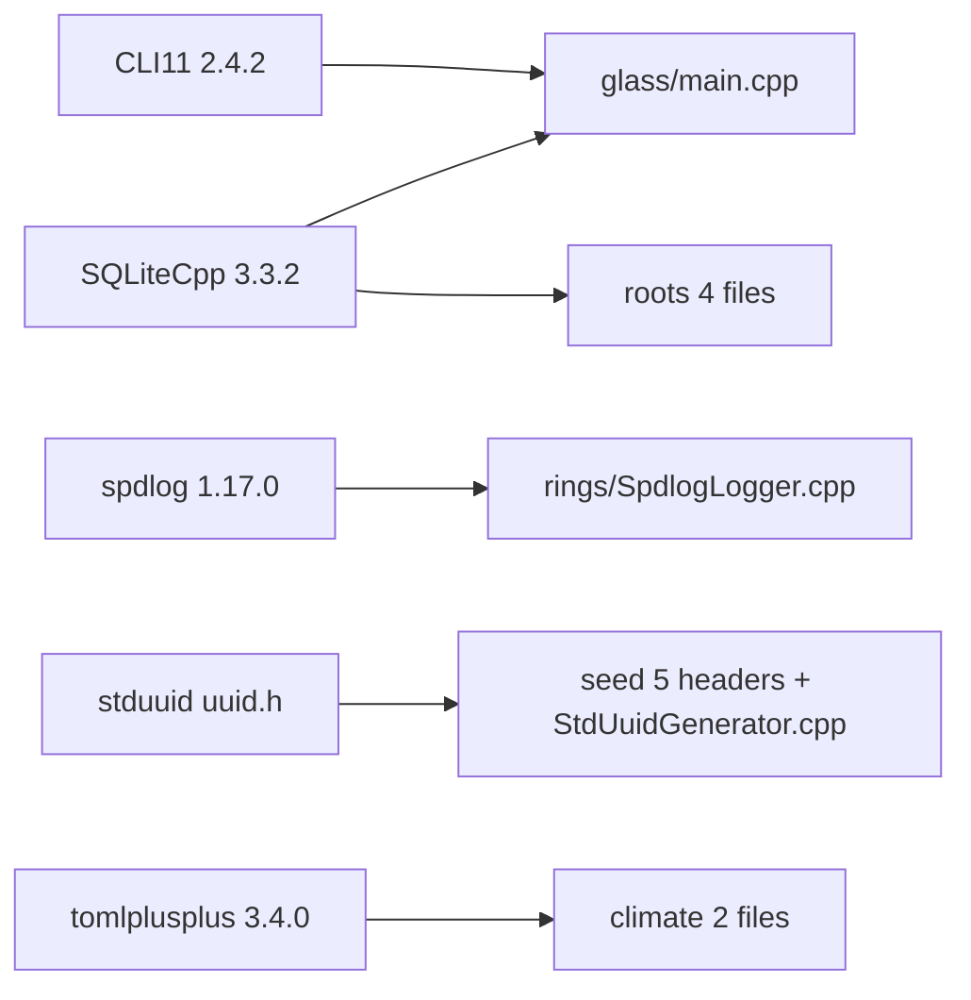

# 외부의존 Facet — Terrarium (CLI_Planning)

`src/` 코드가 의존하는 외부 라이브러리는 모두 `nutrients/` 에 in-tree 벤더링되어 있고(`CMakeLists.txt` 주석상 NF6: 빌드 시 다운로드 0), 헤더의 실제 include 와 CMake 링크 선언을 교차 확인했다. 버전은 벤더된 헤더(`version.h` 등)에서 확인한 실제 값이다.

## 의존 요약 표

| 라이브러리 | 버전 | 용도 | 사용 위치 (src/ 레이어·파일) |
|---|---|---|---|
| **CLI11** | 2.4.2 | CLI 인자/서브커맨드 파싱 (`CLI::App`, `add_subcommand`, 옵션 바인딩) | `glass/main.cpp` (Composition Root) — `#include <CLI/CLI.hpp>` |
| **SQLiteCpp** | 3.3.2 | SQLite C++ 래퍼 — DB 연결, 마이그레이션 실행, 영속화 쿼리 | `roots/MigrationRunner.cpp`, `roots/SqliteEventRepository.cpp`, `roots/SqliteTodoRepository.cpp`, `roots/SqliteGoalRepository.cpp`, `glass/main.cpp` — `#include <SQLiteCpp/SQLiteCpp.h>` |
| **spdlog** | 1.17.0 | 파일/콘솔 로깅, 로테이션(daily·size) 및 레벨 매핑 | `rings/SpdlogLogger.cpp` (logger 어댑터) — `spdlog/spdlog.h` + 4종 sink 헤더 |
| **stduuid** | 헤더온리 (`uuid.h`) | UUID 타입(`uuids::uuid`) 및 v4 랜덤 생성 (엔티티 식별자) | 헤더에 노출: `seed/Event.hpp`, `seed/Goal.hpp`, `seed/Todo.hpp`, `seed/IdGenerator.hpp`, `seed/StdUuidGenerator.hpp`; 생성 구현: `seed/StdUuidGenerator.cpp` — `#include "uuid.h"` |
| **tomlplusplus (toml++)** | 3.4.0 | TOML 설정 파싱 / 기본설정 렌더링 | `climate/TomlConfigLoader.cpp`, `climate/DefaultConfig.cpp` — `#include <toml++/toml.hpp>` |
| **googletest (GTest)** | (벤더) | 단위/통합 테스트 프레임워크 | `src/` 외부 `observation/` 테스트에서만 사용 (`GTest::gtest_main`); src/ 프로덕션 코드에는 미사용 |

세부 주석:
- **stduuid**: include 경로가 `nutrients/stduuid/include` 로 등록되어 `#include "uuid.h"` 로 들어오며, `seed` 도메인 레이어 헤더에 `uuids::uuid` 타입이 직접 노출된다(`Event::Id`, `Goal::Id`, `Todo::Id` = `uuids::uuid`). 즉 도메인 식별자 타입 자체가 이 라이브러리에 결합되어 있다. 실제 생성 로직은 `StdUuidGenerator.cpp` 의 `uuids::uuid_random_generator` 한 곳에 격리되어 있다.
- **CLI11 / SQLiteCpp(중복 링크)**: `gaia` 실행 타깃이 두 라이브러리를 직접 include·링크하는 유일한 src 진입점이며, SQLiteCpp 는 `planning_roots` 레이어에도 PRIVATE 링크된다.
- **googletest**: 분석 범위 src/ 에는 import 가 전혀 없고 `observation/` 테스트 타깃 전용이라, src/ 외부의존으로는 해당 없음(참고용 포함).

## 의존 매핑 보조 그래프

레이어별로 외부의존이 깔끔히 분리된다: 도메인(`seed`)은 stduuid 만, 어댑터는 각각 단일 라이브러리(`roots`=SQLiteCpp, `rings`=spdlog, `climate`=toml++)를 격리하고, CLI11 은 Composition Root(`glass`)에만 묶여 있다.

참고 출처 파일:
- `CMakeLists.txt` (벤더링·링크 선언)
- `src/glass/main.cpp`
- `src/roots/*.cpp`
- `src/rings/SpdlogLogger.cpp`
- `src/climate/{TomlConfigLoader,DefaultConfig}.cpp`
- `src/seed/{StdUuidGenerator.cpp,Event.hpp,Goal.hpp,Todo.hpp,IdGenerator.hpp}`
