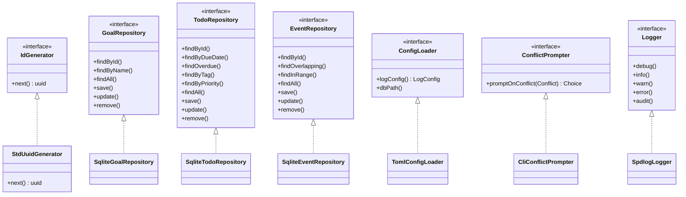
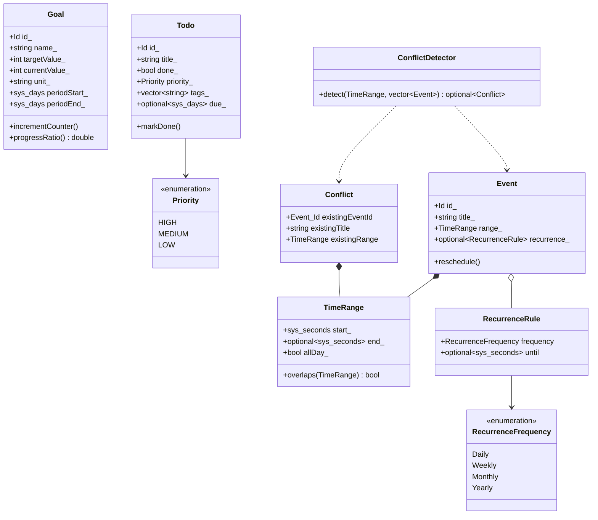
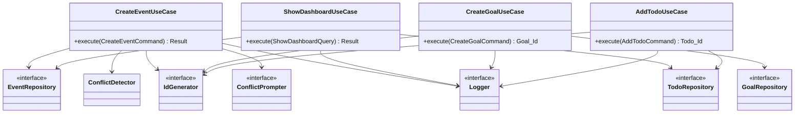

# 타입/관계 facet — CLI_Planning (`src/`)

## 개요

헥사고날(포트-어댑터) 구조로, 식물 메타포 디렉터리가 레이어에 대응한다.

| 디렉터리 | 네임스페이스 | 역할 |
|---|---|---|
| `seed/` | `planning::domain` | 도메인 엔티티(Aggregate Root) + 값 객체 + 도메인 서비스 + 도메인 포트 |
| `stem/` | `planning::application` | 유스케이스 클래스 + 입출력 Command/Query/Result DTO |
| `stomata/` | `planning::ports` | 어댑터 포트(추상 인터페이스) |
| `roots/` `climate/` `rings/` `leaves/` | `planning::adapter_*` | 포트 구현체(SQLite, TOML, spdlog, CLI) |

---

## 1. 도메인 타입 (`seed/`)

### 엔티티 (Aggregate Root)
- **Goal** — 목표값 대비 누적값으로 달성률 표현. `Id = uuids::uuid`. 멤버: `id_, name_, targetValue_, currentValue_, unit_, periodStart_, periodEnd_`. 행위: `incrementCounter`, `rename`, `updateTarget`, `updatePeriod`, `progressRatio`. 불변식 위반 시 `std::invalid_argument`.
- **Todo** — 할 일. `Id = uuids::uuid`. 멤버: `id_, title_, done_, priority_, tags_, due_`. 행위: `markDone`, `rename`, `updatePriority`, `addTag`(멱등), `removeTag`, `setDueDate`.
- **Event** — 일정. `Id = uuids::uuid`. 멤버: `id_, title_, range_(TimeRange), recurrence_(optional<RecurrenceRule>)`. 행위: `reschedule`, `rename`, `setRecurrence`.

### 값 객체
- **TimeRange** — 불변 시간 구간(반열린 `[start, end)`). `start_, end_, allDay_`. `overlaps()` 로 겹침 판정. `start > end` 위반 시 예외.
- **RecurrenceRule** (struct) — `frequency(RecurrenceFrequency), until(optional<sys_seconds>)`.
- **Conflict** (struct) — 충돌 안내용. `existingEventId, existingTitle, existingRange`.

### 열거형
- **Priority** : `HIGH, MEDIUM, LOW`
- **RecurrenceFrequency** : `Daily, Weekly, Monthly, Yearly`

### 도메인 서비스 / 포트
- **ConflictDetector** — `detect(candidate, existingOverlapping) -> optional<Conflict>`.
- **IdGenerator** (추상) — `next() -> uuids::uuid`. 도메인에 위치한 포트.
- **StdUuidGenerator** — `IdGenerator` 구현(stduuid 기반). `engine_, gen_`.

---

## 2. 포트 인터페이스 (`stomata/`)

순수 가상 인터페이스로 가상 소멸자를 가진다.

- **GoalRepository** — `findById`, `findByName`, `findAll`, `save`, `update`, `remove`.
- **TodoRepository** — `findById`, `findByDueDate`, `findOverdue`, `findByTag`, `findByPriority`, `findAll`, `save`, `update`, `remove`.
- **EventRepository** — `findById`, `findOverlapping`, `findInRange`, `findAll`, `save`, `update`, `remove`.
- **ConfigLoader** — `logConfig() -> LogConfig`, `dbPath()`. 중첩 struct **LogConfig**(`path, level, audit, rotationStrategy, debugRetentionDays, auditRetentionDays, separateDebugAudit`).
- **ConflictPrompter** — `promptOnConflict(Conflict) -> Choice`. 중첩 enum **Choice**(`ADD_ANYWAY, CANCEL`).
- **Logger** — `debug`, `info`, `warn`, `error`, `audit(action, detail)`.

---

## 3. 어댑터 구현체

| 구현체 | 디렉터리/ns | 구현 포트 | 주 합성 멤버 |
|---|---|---|---|
| **SqliteGoalRepository** | `roots` / `adapter_sqlite` | GoalRepository | `SQLite::Database& db_` |
| **SqliteTodoRepository** | `roots` | TodoRepository | `db_` |
| **SqliteEventRepository** | `roots` | EventRepository | `db_` |
| **MigrationRunner** | `roots` | (포트 없음) `run(migrationsDir)` | `db_` |
| **TomlConfigLoader** | `climate` / `adapter_config` | ConfigLoader | `log_(LogConfig), dbPath_` |
| **SpdlogLogger** | `rings` / `adapter_logger` | Logger | `debug_, audit_(shared_ptr<spdlog::logger>), auditEnabled_` |
| **CliConflictPrompter** | `leaves` / `adapter_cli` | ConflictPrompter | `in_(istream&), out_(ostream&)` |

`climate/DefaultConfig` 는 자유 함수 `renderDefaultConfig()`, `leaves/CliFormat` 도 자유 함수만(타입 없음).

---

## 4. 유스케이스 (`stem/`) 와 의존

모두 `planning::application`. 생성자 주입으로 포트 참조를 보유하며, 입력은 Command/Query, 일부는 중첩 `Result` 를 반환한다.

| 유스케이스 | 입력 DTO | 보유 포트 의존 |
|---|---|---|
| CreateGoalUseCase | CreateGoalCommand | GoalRepository, IdGenerator, Logger |
| UpdateGoalUseCase | UpdateGoalCommand | GoalRepository, Logger |
| DeleteGoalUseCase | DeleteGoalCommand | GoalRepository, Logger |
| LogGoalUseCase | LogGoalCommand | GoalRepository, Logger |
| ShowGoalUseCase | ShowGoalQuery -> `Result` | GoalRepository, Logger |
| ListGoalsUseCase | (없음) -> `vector<Goal>` | GoalRepository, Logger |
| AddTodoUseCase | AddTodoCommand | TodoRepository, IdGenerator, Logger |
| UpdateTodoUseCase | UpdateTodoCommand | TodoRepository, Logger |
| MarkTodoDoneUseCase | MarkTodoDoneCommand | TodoRepository, Logger |
| DeleteTodoUseCase | DeleteTodoCommand | TodoRepository, Logger |
| ListTodosUseCase | ListTodosQuery -> `vector<Todo>` | TodoRepository, Logger |
| CreateEventUseCase | CreateEventCommand -> `Result` | EventRepository, ConflictDetector, IdGenerator, ConflictPrompter, Logger |
| UpdateEventUseCase | UpdateEventCommand -> `Result` | EventRepository, ConflictDetector, ConflictPrompter, Logger |
| DeleteEventUseCase | DeleteEventCommand | EventRepository, Logger |
| ListEventsUseCase | ListEventsQuery -> `vector<Event>` | EventRepository, Logger |
| ShowDashboardUseCase | ShowDashboardQuery -> `Result` | EventRepository, TodoRepository, Logger |

유스케이스 중첩 Result 구조체: **ShowGoalUseCase::Result**(`name, currentValue, targetValue, unit, progressRatio`), **CreateEventUseCase::Result**(`createdId(optional<Event::Id>), cancelledByUser`), **UpdateEventUseCase::Result**(`cancelledByUser`), **ShowDashboardUseCase::Result**(`todayEventsCount, overdueTodosCount`).

Command/Query DTO(`stem/commands/`): Goal 계열(Create/Update/Delete/Log/ShowQuery), Todo 계열(Add/Update/MarkDone/Delete/ListQuery), Event 계열(Create/Update/Delete/ListQuery), DashboardQuery. 부분 수정 명령은 `optional<optional<...>>` 로 "변경 없음 vs 해제"를 구분(UpdateTodoCommand.due, UpdateEventCommand.end/recurrence).

---

## 5. 클래스 다이어그램 (핵심 타입)

### 5.1 도메인 + 포트 구현 관계 (상속/구현)

### 5.2 도메인 엔티티 + 값 객체 합성

### 5.3 유스케이스 - 포트 의존 (대표)

---

## 관찰 노트
- 상속/구현은 모두 인터페이스 실현 1단계뿐이며, 엔티티 간 상속은 없다(합성만 사용). Goal/Todo/Event 세 도메인이 CRUD 대칭 구조다.
- `IdGenerator` 포트는 다른 포트와 달리 `domain` 네임스페이스에 위치(도메인이 식별자 생성을 직접 추상화).
- 유스케이스는 구현체가 아닌 포트 추상에만 의존(의존성 역전). 시간/타임존 계산은 도메인에 두지 않고 엣지에서 UTC instant 로 변환해 Command/Query 로 주입한다(주석 명시).
