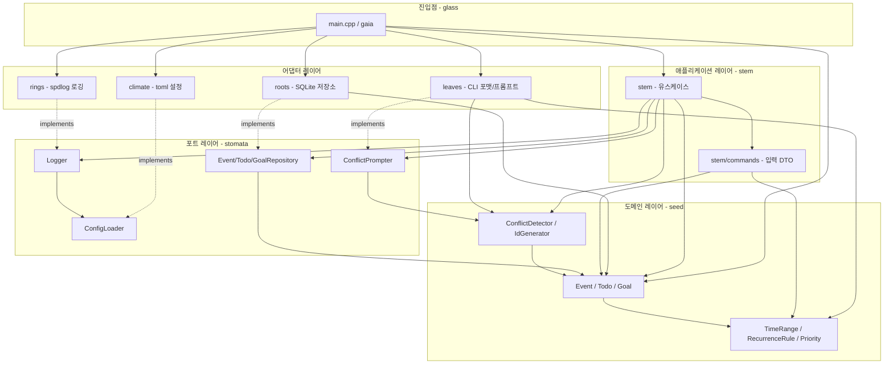
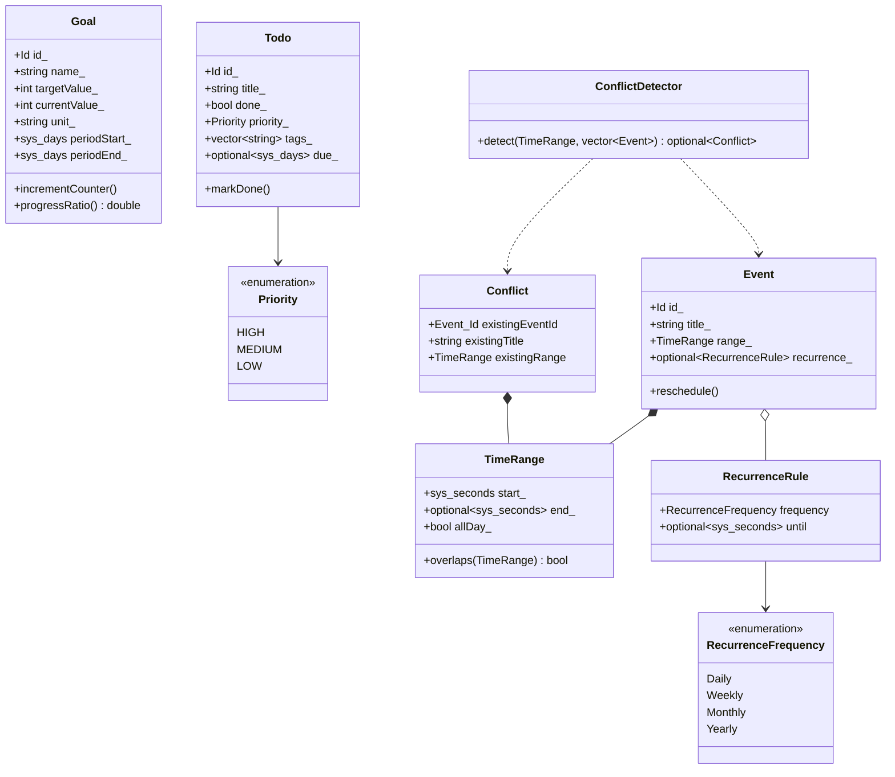
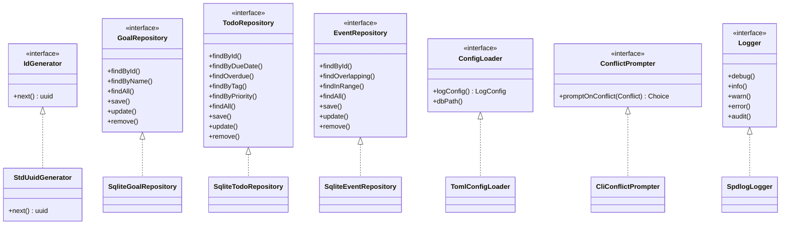
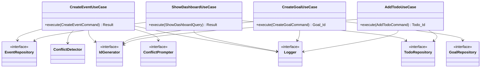
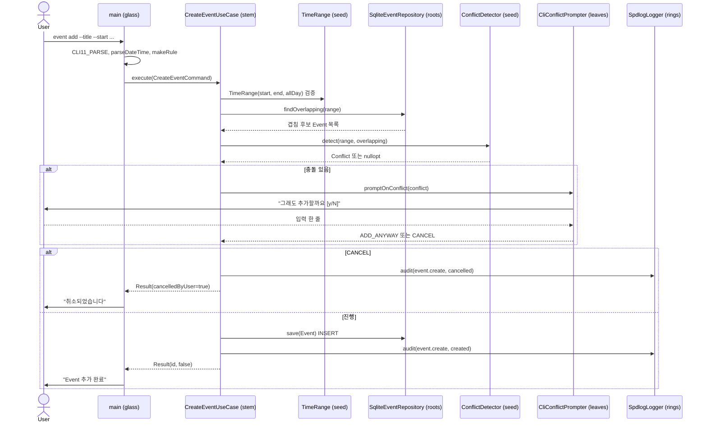
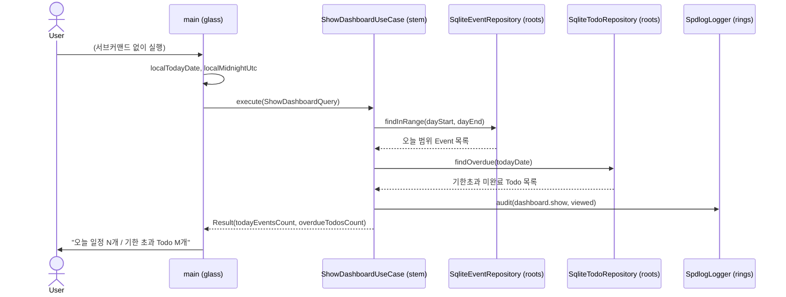
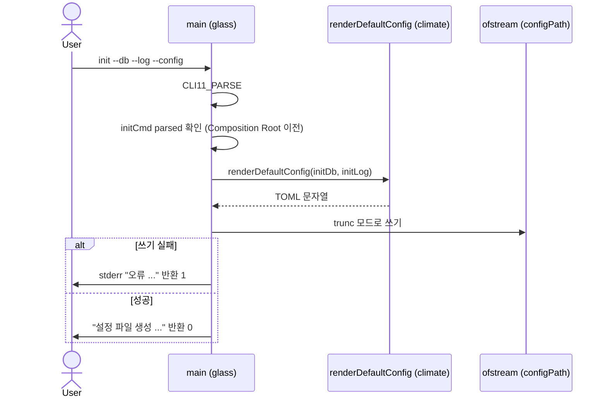
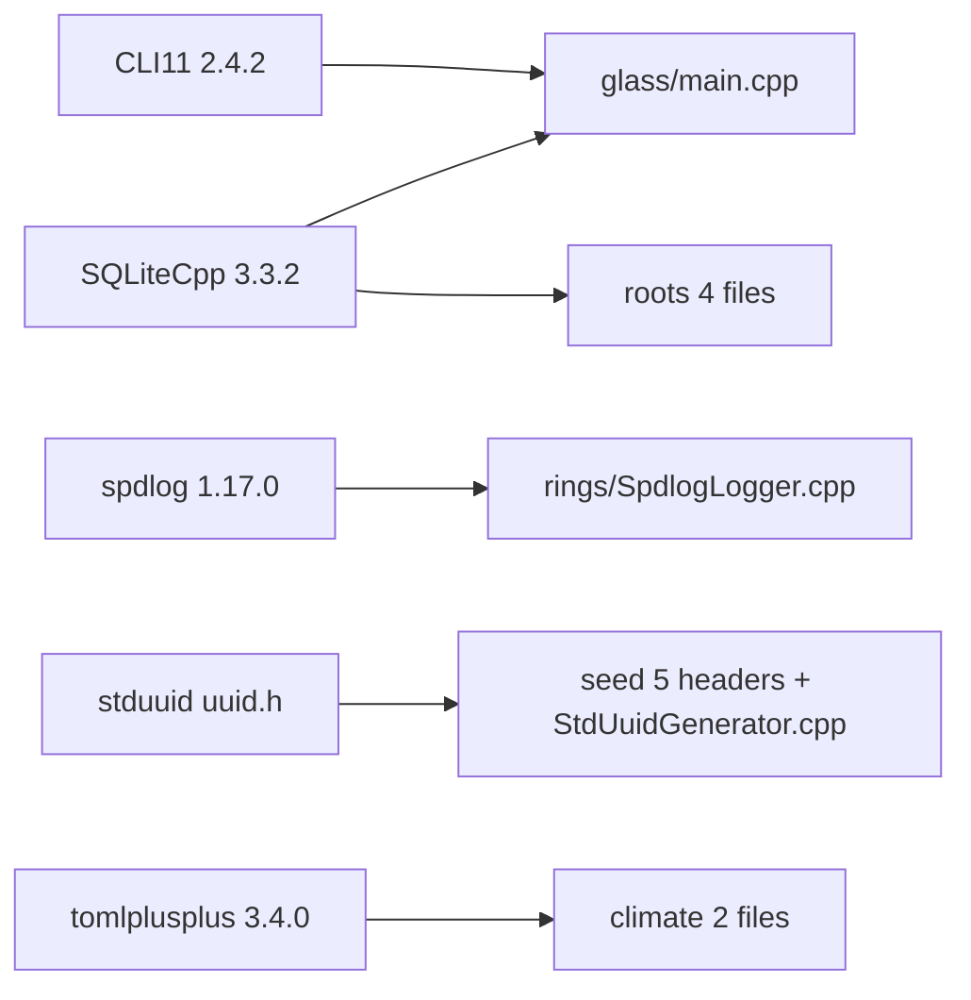

# Terrarium (CLI_Planning) — as-built 아키텍처

> 이 문서는 `src/` 코드와 빌드 설정에서 추출한 facet 집합을 합성한 **as-built 명세**다. 설계 의도가 아니라 실제로 짜여 있는 현실을 서술하며, 코드가 바뀌면 재생성해 동기화한다. 인터랙티브 시각화(Mermaid + 호출그래프 SVG)는 별도 `html/index.html` 산출물에 있다.

## 개요

Terrarium 은 **일정(Event)·할일(Todo)·목표(Goal)** 세 도메인을 SQLite 에 저장·관리하는 C++ 헥사고날(포트-어댑터) CLI 도구다. 디렉토리 네이밍에 식물 메타포를 쓴다: 진입점은 `glass`, 유스케이스는 `stem`, 도메인은 `seed`, 포트는 `stomata`, 어댑터는 각각 `roots`(SQLite)·`rings`(로깅)·`climate`(설정)·`leaves`(CLI 입출력).

핵심 도메인/유스케이스(`planning_core`)는 추상 인터페이스(`stomata` 포트)에만 의존하고, 구체 기술(SQLite, spdlog, toml++, CLI11)은 별도 어댑터 라이브러리로 분리되어 **의존성이 안쪽으로만 향한다.** 실행 파일 `gaia`(`src/glass/main.cpp`)가 유일한 컴포지션 루트로서 어댑터를 손으로 조립한다.

문서 전체를 관통하는 단 하나의 설계 원칙은 다음과 같다:

> **벽시계·로컬 타임존·달력 경계 계산은 모두 엣지(`glass`/`leaves`)에서 하고, 내부 도메인/저장소는 UTC instant(`sys_seconds`)와 순수 달력 날짜(`sys_days`)만 다룬다.**

### 진입점

| 구분 | 위치 | 설명 |
|---|---|---|
| 실행 진입점 | `src/glass/main.cpp` (`main`) | 유일한 OS 진입점이자 Composition Root. 빌드 산출물 `gaia` |
| 논리 진입점 | `src/stem/*UseCase::execute()` 16개 | Event/Todo/Goal 의 CRUD·List·Show + Dashboard |

---

## 1. 아키텍처와 레이어

식물 메타포 디렉토리가 헥사고날 레이어에 1:1 대응하고, 빌드 타겟도 모듈 경계와 1:1 대응한다.

| 디렉토리 | 네임스페이스 | 레이어 | 빌드 타겟 | 역할 |
|---|---|---|---|---|
| `glass` | — | 진입점/조립 | `gaia` (exe) | `main()` 컴포지션 루트. CLI11 파싱, 어댑터 주입, 유스케이스 디스패치 |
| `stem` (+`commands`) | `planning::application` | 유스케이스 + 입력 DTO | `planning_core` | 도메인 작업 오케스트레이션. 포트에만 의존 |
| `seed` | `planning::domain` | 도메인 엔티티/값객체/서비스 | `planning_core` | Event/Todo/Goal, 값객체, ConflictDetector, IdGenerator |
| `stomata` | `planning::ports` | 포트(추상 인터페이스) | `planning_core` (헤더) | Repository 3종, Logger, ConfigLoader, ConflictPrompter |
| `roots` | `planning::adapter_sqlite` | 어댑터(driven) | `planning_roots` | SQLite 저장소 + 마이그레이션 (SQLiteCpp) |
| `rings` | `planning::adapter_logger` | 어댑터(driven) | `planning_rings` | spdlog 로깅 |
| `climate` | `planning::adapter_config` | 어댑터(driven) | `planning_climate` | toml++ 설정 로딩/렌더 |
| `leaves` | `planning::adapter_cli` | 어댑터(driving 보조) | `planning_leaves` | CLI 포맷/충돌 프롬프트 |

```
src/
├── glass/        # 진입점 (main.cpp) = Composition Root
├── stem/         # 유스케이스 (application layer)
│   ├── commands/ #   - 입력 DTO (Create/Update/Delete command 구조체)
│   └── queries/  #   - 조회 DTO (현재 비어 있음)
├── seed/         # 도메인 엔티티 / 값객체 / 도메인 서비스
├── stomata/      # 포트 (추상 인터페이스)
├── roots/        # 어댑터 - SQLite 저장소 + 마이그레이션
├── rings/        # 어댑터 - 로깅 (spdlog)
├── climate/      # 어댑터 - 설정 로딩 (toml++)
└── leaves/       # 어댑터 - CLI 출력 포맷 / 충돌 프롬프트
CMakeLists.txt    # 라이브러리/실행파일 타겟 정의
```

### 의존성 방향

핵심 규칙: 어댑터(`roots`/`rings`/`climate`/`leaves`)는 포트(`stomata`)를 **구현**하고, 유스케이스(`stem`)는 포트에만 의존한다. 따라서 도메인/유스케이스는 구체 기술을 모른다(의존성 역전). 진입점 `glass`만 어댑터와 코어를 동시에 알고 조립한다. **순환 의존이 없으며**, 모든 화살표가 진입점 -> 어댑터/유스케이스 -> 포트 -> 도메인의 단방향이다.



빌드 측면에서 `seed`/`stem`/`stomata` 는 모두 `planning_core` 한 타겟에 묶여 있고(헤더-only 포트 포함), 어댑터들은 `planning_core` 에 PUBLIC 링크하면서 외부 라이브러리는 PRIVATE 으로 캡슐화한다. 의존성 역전은 일관적이다 — `stem` 유스케이스 헤더에는 구체 어댑터 include 가 단 하나도 없고 포트만 참조한다.

알아둘 현실 한 가지: 외부 헤더 `uuid.h`(stduuid)가 도메인 식별자 타입(`Event::Id` 등)을 통해 `seed` 헤더에 직접 노출된다. 도메인이 id 생성용 vendor 타입에 헤더 수준으로 결합된 유일한 지점이다(상세는 §4). 또 `stem/queries/` 디렉토리는 존재하지만 비어 있어, 현재 조회는 엔티티를 직접 반환한다.

---

## 2. 타입과 관계

### 도메인 엔티티 (Aggregate Root, `seed/`)

세 도메인 모두 식별자가 `uuids::uuid` 이고 생성자에서 불변식을 검증한다(위반 시 `std::invalid_argument`). 엔티티 간 상속은 없고 값객체 합성만 사용하며, CRUD 가 대칭 구조다.

- **Event** — 일정. `title_`, `range_(TimeRange)`, `recurrence_(optional<RecurrenceRule>)`. 행위: `reschedule`, `rename`, `setRecurrence`. 빈 제목이면 예외.
- **Todo** — 할일. `title_`, `done_`, `priority_`, `tags_`, `due_`. 행위: `markDone`, `rename`, `updatePriority`, `addTag`(멱등), `removeTag`, `setDueDate`.
- **Goal** — 목표. 목표값(`targetValue_`) 대비 누적값(`currentValue_`)으로 달성률을 계산. 행위: `incrementCounter`, `rename`, `updateTarget`, `updatePeriod`, `progressRatio`. `targetValue<=0` 또는 `periodStart>periodEnd` 면 예외. 달성률은 상한이 없어 초과 달성 시 1.0 을 넘는다. 영속성 복원용 별도 생성자가 있다.

### 값 객체와 열거형

- **TimeRange** — 불변 시간 구간(반열린 `[start, end)`). `start_`, `end_(optional)`, `allDay_`. **종료시각이 없으면 시작시각을 종료로 간주**(`effectiveEnd`)하고 `overlaps()` 로 겹침을 판정한다 — 충돌 탐지의 근거다. `start > end` 위반 시 예외.
- **RecurrenceRule** (struct) — `frequency(RecurrenceFrequency)`, `until(optional<sys_seconds>)`.
- **Conflict** (struct) — `existingEventId`, `existingTitle`, `existingRange`.
- **Priority** : `HIGH, MEDIUM, LOW`
- **RecurrenceFrequency** : `Daily, Weekly, Monthly, Yearly`

### 도메인 서비스와 도메인 포트

- **ConflictDetector** — `detect(candidate, existingOverlapping) -> optional<Conflict>`. 후보 조회는 저장소가 하고, 이 서비스는 판정만 한다.
- **IdGenerator** (추상) — `next() -> uuids::uuid`. 다른 포트와 달리 `domain` 네임스페이스에 위치(도메인이 식별자 생성을 직접 추상화).
- **StdUuidGenerator** — `IdGenerator` 구현(stduuid `uuid_random_generator`, `random_device` 시드).



### 포트와 어댑터 구현 (`stomata/` <- `roots`/`rings`/`climate`/`leaves`)

포트는 모두 순수 가상 인터페이스(가상 소멸자 보유)이고, 구현체는 각 1개뿐이라 1:1 해석이 안전하다. 저장소 포트는 "로컬 달력 경계 계산은 엣지가 하고 UTC instant 로 넘긴다"는 계약을 주석으로 못박는다.

- **GoalRepository** — `findById`, `findByName`, `findAll`, `save`, `update`, `remove`
- **TodoRepository** — `findById`, `findByDueDate`, `findOverdue`, `findByTag`, `findByPriority`, `findAll`, `save`, `update`, `remove`
- **EventRepository** — `findById`, `findOverlapping`, `findInRange`, `findAll`, `save`, `update`, `remove`
- **ConfigLoader** — `logConfig() -> LogConfig`, `dbPath()` (중첩 struct `LogConfig`)
- **ConflictPrompter** — `promptOnConflict(Conflict) -> Choice` (중첩 enum `Choice{ADD_ANYWAY, CANCEL}`)
- **Logger** — `debug`, `info`, `warn`, `error`, `audit(action, detail)`

| 구현체 | 디렉터리 | 구현 포트 | 주 합성 멤버 |
|---|---|---|---|
| SqliteGoalRepository | `roots` | GoalRepository | `SQLite::Database& db_` |
| SqliteTodoRepository | `roots` | TodoRepository | `db_` |
| SqliteEventRepository | `roots` | EventRepository | `db_` |
| MigrationRunner | `roots` | (포트 없음) `run(migrationsDir)` | `db_` |
| TomlConfigLoader | `climate` | ConfigLoader | `log_(LogConfig), dbPath_` |
| SpdlogLogger | `rings` | Logger | `debug_, audit_, auditEnabled_` |
| CliConflictPrompter | `leaves` | ConflictPrompter | `in_(istream&), out_(ostream&)` |

`climate/DefaultConfig`(자유 함수 `renderDefaultConfig()`)와 `leaves/CliFormat`(자유 함수만)은 타입이 없다.



### 유스케이스와 포트 의존 (`stem/`)

16개 유스케이스는 모두 `planning::application` 에 있고, 생성자 주입으로 포트 참조를 보유하며, 입력은 Command/Query, 일부는 중첩 `Result` 를 반환한다.

| 유스케이스 | 입력 DTO | 보유 포트 의존 |
|---|---|---|
| CreateGoalUseCase | CreateGoalCommand | GoalRepository, IdGenerator, Logger |
| UpdateGoalUseCase | UpdateGoalCommand | GoalRepository, Logger |
| DeleteGoalUseCase | DeleteGoalCommand | GoalRepository, Logger |
| LogGoalUseCase | LogGoalCommand | GoalRepository, Logger |
| ShowGoalUseCase | ShowGoalQuery -> `Result` | GoalRepository, Logger |
| ListGoalsUseCase | (없음) -> `vector<Goal>` | GoalRepository, Logger |
| AddTodoUseCase | AddTodoCommand | TodoRepository, IdGenerator, Logger |
| UpdateTodoUseCase | UpdateTodoCommand | TodoRepository, Logger |
| MarkTodoDoneUseCase | MarkTodoDoneCommand | TodoRepository, Logger |
| DeleteTodoUseCase | DeleteTodoCommand | TodoRepository, Logger |
| ListTodosUseCase | ListTodosQuery -> `vector<Todo>` | TodoRepository, Logger |
| CreateEventUseCase | CreateEventCommand -> `Result` | EventRepository, ConflictDetector, IdGenerator, ConflictPrompter, Logger |
| UpdateEventUseCase | UpdateEventCommand -> `Result` | EventRepository, ConflictDetector, ConflictPrompter, Logger |
| DeleteEventUseCase | DeleteEventCommand | EventRepository, Logger |
| ListEventsUseCase | ListEventsQuery -> `vector<Event>` | EventRepository, Logger |
| ShowDashboardUseCase | ShowDashboardQuery -> `Result` | EventRepository, TodoRepository, Logger |

부분 수정 명령은 `optional<optional<...>>` 로 "변경 없음 vs 해제"를 구분한다(`UpdateTodoCommand.due`, `UpdateEventCommand.end/recurrence`). 중첩 Result 로는 `CreateEventUseCase::Result{createdId, cancelledByUser}`, `ShowDashboardUseCase::Result{todayEventsCount, overdueTodosCount}` 등이 있다.



---

## 3. 주요 플로우

`main`(glass)은 단일 진입점에서 CLI11 로 인자를 파싱하고, Composition Root 에서 모든 어댑터·도메인·유스케이스를 한 번에 조립한 뒤, 파싱된 서브커맨드에 따라 해당 유스케이스(stem)를 호출한다. 유스케이스는 포트(stomata)를 통해서만 저장소(roots)·도메인(seed)에 접근하고, 결과를 `main` 에 돌려주면 `main` 이 leaves 포맷 함수로 콘솔에 출력한다. 아래 세 시나리오는 각각 (1) 분기가 가장 많은 쓰기 경로, (2) 두 저장소를 동시에 읽는 기본 조회 경로, (3) Composition Root 진입 전에 처리되는 예외적 부트스트랩 경로를 대표한다.

### 공통 부트스트랩

`main` 은 먼저 `--config` 등 모든 옵션과 서브커맨드를 CLI11 에 등록하고 `CLI11_PARSE` 로 파싱한다. `init` 이 파싱된 경우에만 Composition Root 진입 전에 따로 처리하고(시나리오 3), 그 외에는 try 블록 안에서 `TomlConfigLoader` 로 설정을 읽고, `SpdlogLogger`·`SQLite::Database`(WAL/foreign_keys PRAGMA)·`MigrationRunner.run` 으로 스키마를 올린 뒤, 세 SQLite 저장소·`ConflictDetector`·`StdUuidGenerator`·`CliConflictPrompter` 를 만들어 16개 유스케이스를 전부 인스턴스화한다. 그다음 거대한 if/else 체인이 디스패치를 담당하고, 어느 분기에서든 예외가 던져지면 맨 바깥 catch 가 `오류: ...` 를 stderr 로 찍고 종료코드 1 을 반환한다.

### 시나리오 1: `event add` — 충돌 검사와 사용자 확인이 있는 쓰기 경로

저장 전에 도메인 검증·저장소 조회·도메인 충돌 판정·대화형 프롬프트를 모두 거치는, 가장 흐름이 긴 쓰기 경로다.

`main` 의 `eventAdd` 분기는 파싱된 문자열 옵션을 leaves 의 `parseDateTime`/`makeRule`(`--repeat`/`--until` 을 `RecurrenceRule` 로 변환) 로 변환해 `CreateEventCommand` 를 채우고 `createEvent.execute(cmd)` 를 호출한다. `CreateEventUseCase::execute` 는 먼저 `TimeRange` 생성자로 시간 구간을 검증한다(잘못된 구간이면 `invalid_argument` 가 main 의 catch 로 올라간다). 이어 `events_.findOverlapping(range)` 로 겹칠 수 있는 후보를 조회하는데, SQLite 저장소는 `start_ts < candEnd AND COALESCE(end_ts, start_ts) > candStart` 조건의 SELECT 로 후보 행을 모아 도메인 `Event` 로 복원한다. 유스케이스는 그 후보 목록을 `detector_.detect(range, overlapping)` 에 넘기고, `ConflictDetector` 는 각 후보의 `TimeRange::overlaps` 로 첫 충돌을 `Conflict` 로 반환한다.

충돌이 있으면 `prompter_.promptOnConflict` 가 호출되어 `CliConflictPrompter` 가 "...겹칩니다. 그래도 추가할까요? [y/N]" 를 stdout 에 출력하고 stdin 에서 한 줄을 읽는다. 입력이 `y`/`Y`/`yes` 가 아니거나 EOF 이면 `CANCEL` 을 반환하고, 유스케이스는 `event.create` 감사 로그를 남긴 뒤 `cancelledByUser=true` 인 Result 를 돌려줘 main 이 "취소되었습니다" 를 출력한다. 진행으로 답하면 `idGen_.next()` 로 UUID 를 발급해 `Event` 를 만들고 `events_.save(event)` 가 INSERT 를 실행하며, 감사 로그 후 Result 를 돌려줘 main 이 "Event ... 추가 완료" 를 출력한다.



### 시나리오 2: 서브커맨드 없음 — 대시보드(두 저장소 동시 조회)

서브커맨드를 주지 않았을 때 도달하는 기본 경로이자, 한 유스케이스가 서로 다른 두 저장소를 함께 읽어 집계하는 유일한 조회 경로다.

if/else 체인의 모든 `parsed()` 가 거짓이면 최종 else 가 실행된다. `main` 은 `localTodayDate()` 로 시스템 로컬 타임존 기준 오늘 달력 날짜를 구해 `ShowDashboardQuery` 에 담는다. `todayDate` 는 todo 기한초과 비교용 로컬 달력 날짜이고, `dayStart`/`dayEnd` 는 로컬 [오늘 자정, 내일 자정) 을 `localMidnightUtc` 로 UTC instant 로 변환해 event 범위 조회에 쓴다. `dashboard.execute(q)` 안에서 `ShowDashboardUseCase` 는 `events_.findInRange(dayStart, dayEnd)` 로 오늘 범위 이벤트를, `todos_.findOverdue(todayDate)` 로 기한이 지난 미완료 todo 를 조회한다. 두 결과의 `size()` 만 추려 `Result{todayEventsCount, overdueTodosCount}` 로 반환하고(반복 이벤트 인스턴스 카운트는 미구현 TODO), `dashboard.show` 감사 로그를 남긴다. main 은 "오늘 일정 N개 / 기한 초과 Todo M개" 를 출력한다.



### 시나리오 3: `init` — Composition Root 이전의 설정 부트스트랩

설정을 "읽는" 다른 모든 명령과 달리 설정을 "쓰는" 명령이라, DB·로거·저장소 조립(Composition Root) 자체를 건너뛰고 파싱 직후 따로 처리되는 예외적 흐름이다.

`CLI11_PARSE` 직후 `main` 은 `initCmd->parsed()` 를 가장 먼저 검사한다. 참이면 `--db`/`--log` 경로를 `renderDefaultConfig(initDb, initLog)` 에 넘기고, climate 어댑터는 toml++ 로 `[database].path` 와 `[log]` 섹션(level=INFO, audit=true, rotation=none 등 기본값)을 가진 테이블을 TOML 문자열로 직렬화해 반환한다. main 은 그 문자열을 `--config` 경로에 `trunc`(항상 덮어쓰기) `ofstream` 으로 기록하고, 열 수 없으면 `runtime_error` 를 던진다(로컬 try/catch 가 "오류: ..." 출력 후 1 반환). 성공하면 "설정 파일 생성: ..." 를 출력하고 즉시 `return 0` 하므로 SQLite 연결이나 마이그레이션은 전혀 일어나지 않는다.



---

## 4. 외부 의존

`src/` 가 의존하는 외부 라이브러리는 모두 `nutrients/` 에 in-tree 벤더링되어 있다(빌드 시 다운로드 0). 버전은 벤더된 헤더에서 확인한 실제 값이다.

| 라이브러리 | 버전 | 용도 | 사용 위치 |
|---|---|---|---|
| **CLI11** | 2.4.2 | CLI 인자/서브커맨드 파싱 | `glass/main.cpp` (Composition Root) |
| **SQLiteCpp** | 3.3.2 | SQLite C++ 래퍼 — 연결, 마이그레이션, 영속화 쿼리 | `roots/*.cpp`, `glass/main.cpp` |
| **spdlog** | 1.17.0 | 파일/콘솔 로깅, 로테이션, 레벨 매핑 | `rings/SpdlogLogger.cpp` |
| **stduuid** | 헤더온리 (`uuid.h`) | UUID 타입 및 v4 랜덤 생성 | `seed/` 헤더 5종 + `seed/StdUuidGenerator.cpp` |
| **tomlplusplus (toml++)** | 3.4.0 | TOML 설정 파싱 / 기본설정 렌더 | `climate/{TomlConfigLoader,DefaultConfig}.cpp` |
| **googletest** | (벤더) | 단위/통합 테스트 | `observation/` 테스트 전용 — src/ 프로덕션엔 미사용 |

레이어별 외부의존이 깔끔히 분리된다: 도메인(`seed`)은 stduuid 만, 어댑터는 각각 단일 라이브러리(`roots`=SQLiteCpp, `rings`=spdlog, `climate`=toml++)를 격리하고, CLI11 은 Composition Root(`glass`)에만 묶여 있다.



주의할 결합: **stduuid** 의 `uuids::uuid` 가 `Event::Id`/`Goal::Id`/`Todo::Id` 로 도메인 헤더에 직접 노출되어 도메인 식별자 타입 자체가 이 라이브러리에 묶여 있다. 다만 실제 생성 로직은 `StdUuidGenerator.cpp` 한 곳에 격리되어 있다. **CLI11/SQLiteCpp** 는 `gaia` 실행 타깃이 직접 링크하는 유일한 src 진입점이며, SQLiteCpp 는 `planning_roots` 에도 PRIVATE 링크된다.

---

## 5. 모듈별 로직 요약

관통 원칙은 다시 한번 — **벽시계·로컬 타임존·달력 계산은 엣지(glass/leaves)에서, 내부는 UTC instant 와 순수 달력 날짜만.**

### glass — 진입점 / Composition Root

CLI11 로 서브커맨드 트리(`event/todo/goal` 의 add·list·update·delete 등 + `init`, 무인자 시 대시보드)를 정의하고 파싱 인자를 Command/Query 로 변환해 호출한다. 세 가지 책임: (1) **의존성 조립** — 설정 로드 -> 로거 -> DB 연결 -> 마이그레이션 -> 저장소·서비스·유스케이스를 손으로 생성·주입(구체 구현을 아는 유일한 자리). (2) **벽시계 의존 정책** — `localTodayDate()` 로 "오늘"을 읽는 부수효과를 여기에만 둔다. (3) **부분 수정 플래그 충돌 검증** — `--end`/`--clear-end`, `--all-day`/`--no-all-day`, `--due`/`--clear-due` 등 상호 배타 플래그 동시 사용을 거부하고, 목표 기간 변경은 `--from`/`--to` 를 반드시 함께 요구. 모든 도메인 예외를 잡아 "오류: ..." 출력 후 종료코드 1. `init` 은 설정을 쓰는 동작이라 Composition Root 진입 전에 따로 처리한다(`trunc` 덮어쓰기).

### seed — 도메인 엔티티와 순수 규칙

외부 의존 없는(stduuid id 타입 제외) 핵심 비즈니스 객체. 모두 생성자에서 불변식을 검증한다. `TimeRange::overlaps` 가 충돌 탐지의 근거이고, `ConflictDetector` 는 후보 목록을 받아 첫 충돌만 판정한다(조회는 저장소 책임). `StdUuidGenerator` 는 `random_device` 시드로 UUID v4 를 만든다.

### stem — 유스케이스

각 유스케이스는 포트만 의존하고 도메인 객체를 조립·조작해 저장소에 위임하며, 공통적으로 끝에 `logger.audit(...)` 를 남긴다. 대부분 단순 CRUD 위임이고, 로직이 실린 곳은 다음이다.

- **CreateEventUseCase / UpdateEventUseCase** — 저장 전 시간 충돌 검사. Update 는 자기 자신을 충돌 대상에서 제외하고 시간이 바뀐 경우에만 검사한다. 취소 시 저장하지 않고 `cancelledByUser` 반환.
- **ListEventsUseCase** — 가장 무거운 로직. `findAll` 후(인덱스 최적화 TODO) 비반복은 윈도우 겹침 필터, 반복은 `[winStart,winEnd)` 안 occurrence 로 전개한다. 월/년 반복에서 존재하지 않는 날(1/31->2월)은 그 달 마지막 날로 클램프하고, 무한루프 방지 `kSafetyCap=200000` 상한이 있다. 결과는 시작시각 오름차순 정렬.
- **CreateGoalUseCase** — 같은 이름 목표가 있으면 거부(이름 유일성).
- **LogGoalUseCase / ShowGoalUseCase** — `findByName` 직접 조회로 진행 +1 또는 달성률 표시. 진행 기록은 기간 종료 여부와 무관하게 누적된다.
- **ListTodosUseCase** — 전부 가져와 인메모리로 `오늘마감/기한초과/태그/우선순위` 필터를 AND 결합. "기한초과"는 미완료이면서 마감일이 기준일보다 과거인 것.
- **UpdateTodoUseCase** — 부분 수정. 태그가 주어지면 기존 태그 전체 제거 후 새 목록으로 전체 교체.
- **ShowDashboardUseCase** — 오늘 이벤트 수 + 기한초과 Todo 수 집계. 이벤트 카운트는 반복 인스턴스를 세지 않는다(TODO).

Update/Delete/Done/Log 계열은 대상이 없으면 `std::out_of_range` 를 던진다(엣지에서 잡아 오류 출력).

### roots — SQLite 영속성 어댑터

도메인 객체 <-> DB 행 매핑. **SqliteEventRepository** 는 시각을 epoch 초(int64), UUID 를 문자열로 저장하고, `findOverlapping`/`findInRange` 의 겹침 SQL(`start_ts < ? AND COALESCE(end_ts, start_ts) > ?`)로 도메인의 반열린구간 규칙을 그대로 구현한다. **SqliteGoalRepository** 는 날짜를 epoch days 로 저장하고 `findByName` 을 지원한다. **MigrationRunner** 는 `schema_version` 테이블을 만들고 마이그레이션 디렉토리(`TERRARIUM_MIGRATIONS_DIR`)의 `.sql` 을 파일명 앞 숫자(버전) 순으로 정렬·적용하며, 이미 적용된 버전은 건너뛰고 각 마이그레이션을 트랜잭션으로 감싸 실패 시 롤백한다.

### climate — 설정

**TomlConfigLoader** 는 TOML 을 읽어 DB 경로(필수)·로그 설정을 제공하고, 파일 없음과 파싱 오류를 모두 `runtime_error` 로 통일한다. **DefaultConfig**(`renderDefaultConfig`)는 `init` 이 쓸 기본 TOML 문자열을 생성한다(toml++ 키 정렬 직렬화로 출력 순서 비보장).

### rings — 로깅

spdlog 기반 Logger 포트 구현. 회전 전략(none/daily/size)을 골라 파일 싱크를 만들고 디버그/감사 로그를 분리(`separateDebugAudit`)할 수 있다. **파일 싱크 생성 실패 시 예외를 밖으로 던지지 않고 stderr 로 폴백** — 로깅 실패가 앱을 죽이지 않게 한다. `audit` 가 꺼져 있으면 감사 로그를 무시한다.

### leaves — CLI 입출력 어댑터

테스트 가능하도록 main 에서 분리한 순수 변환·입출력 계층. **CliFormat** 은 파싱(`parseDateTime`/`parseDate`/`parsePriority`/`parseFrequency`)·포맷(`formatDate`/`progressBar` 등)과 **로컬<->UTC 변환의 핵심**(`localCivilToUtc`/`localMidnightUtc`)을 담당한다. 진행 막대는 `#`/`-` ASCII 로 그린다. **CliConflictPrompter** 는 "[y/N]" 으로 묻고 `y/Y/yes` 만 강행, 그 외와 EOF(비대화형)는 안전하게 취소한다.

### 전체적 가정과 제약

- 시간 정책: 입력/표시는 로컬 타임존, 내부 저장은 UTC. 달력 경계는 엣지에서 계산해 UTC instant 로 변환 후 저장소에 넘긴다.
- 목록/대시보드의 반복 이벤트는 인메모리 `findAll` 후 전개(성능 최적화 TODO), 대시보드 이벤트 카운트는 반복 인스턴스를 세지 않는다.
- 목표 이름은 유일하며, 진행 기록은 기간 만료를 검사하지 않고 무조건 누적한다.
- 비대화형 환경에서 충돌이 나면 입력이 없으므로 항상 취소된다.

---

## 6. 호출그래프 요약

clang/LLVM 17 IR 경로(`clang++ -emit-llvm` -> `llvm-link` -> `opt -passes=dot-callgraph` -> 디맹글)로 `src/` 32개 TU 전부를 IR 화해 추출했다. 벤더/테스트/build 는 제외하고 `planning::` 함수 간 관계만 남긴 뒤, **큐레이션**으로 ctor/dtor·사소한 getter(IR 실체 기준)·익명 네임스페이스 헬퍼·람다 클로저를 제거해 **의미함수 84개**만 남겼다(노드 ID 는 맹글 심볼 전체 해시로 유일성 보장). 진입점은 `main` 1개 + 유스케이스 `execute()` 16개 = 총 17개다. 시각화는 모듈 8노드 오버뷰(overview-modules), 모듈 박스로 묶은 전체 지도(full-clustered), 진입점별 드릴다운 17장으로 구성되며 인터랙티브 렌더는 `html/index.html` 을 참조한다(이미지는 마크다운에 포함하지 않는다).

> 재현 주의: 원 빌드는 g++-13(C++20 chrono 타임존 API). clang 17 은 번들 libstdc++ 11.5 헤더를 먼저 잡아 `CliFormat.cpp`/`main.cpp` 가 `time_zone` 미정의로 실패하므로, `--gcc-install-dir=/usr/lib/gcc/x86_64-linux-gnu/13` 을 넘겨야 leaves 와 main 진입점이 그래프에 포함된다.

전형 흐름은 `main -> UseCase::execute -> (port 경유 virtual) -> Sqlite*Repository / SpdlogLogger / CliConflictPrompter -> domain(seed)` 이다. 쓰기 계열은 `execute()` 가 도메인 mutator(`Todo::markDone` 등)를 직접 호출해 상태를 바꾼 뒤 repository `save`/`update`/`remove` 를 virtual 로 호출하고 끝에 로그를 남긴다. 읽기 계열은 repository `find*`(virtual)로 엔티티를 받아 도메인 getter 를 직접 호출한다. 충돌 검출 분기는 CreateEvent/UpdateEvent 두 유스케이스만 ConflictDetector(직접)와 ConflictPrompter(virtual)를 탄다.

모듈 간 정적 직접 엣지의 핵심 관찰: **`stem(application)` 에서 어댑터(`roots`/`rings`/`leaves`)로 가는 직접 엣지가 하나도 없다.** 유스케이스는 어댑터를 컴파일타임에 모르고, 그 호출은 전부 추정(virtual) 엣지로만 나타난다 — 헥사고날 경계의 정적 그래프상 증거다. 주요 cross-module 직접 엣지는 `stem -> seed` 54(유스케이스 비즈니스 로직 본체), `roots -> seed` 58(SQL<->엔티티 매핑), `glass -> stem` 35, `glass -> seed` 21 이다.

포트는 모두 순수 가상이고 구현체가 각 1개뿐이라 CHA(클래스 계층 분석)로 1:1 안전 해석된다(EventRepository -> SqliteEventRepository 등). Logger 는 16개 전 유스케이스가 공통 가상 호출하고, ConflictPrompter 는 CreateEvent/UpdateEvent 2개만 가상 호출한다. 다만 추정 엣지의 **타깃 메서드**는 vtable 슬롯 단정이 어려워 대표 메서드(주로 `save`)로 단순화했다 — "도달 어댑터 클래스"는 정확하나 "어댑터 내 정확한 메서드"는 근사다.

> 시각화: 호출그래프 SVG(전체 오버뷰 1장 + 진입점별 드릴다운 17장)는 마크다운에 포함하지 않는다. 인터랙티브 렌더는 `html/index.html` 산출물을 참조한다.
