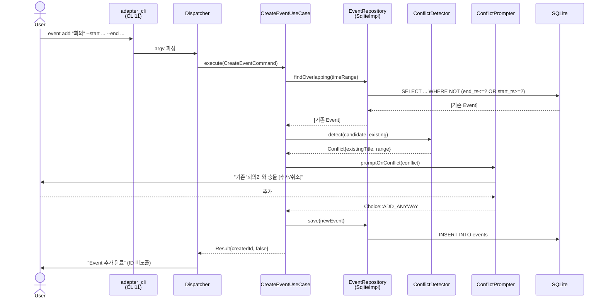

# 01. Event 추가 (충돌 발생 케이스)

**UseCase:** `CreateEventUseCase`

사용자가 `event add` 로 신규 일정을 추가했는데 기존 일정과 시간이 겹치는 경우. `ConflictDetector` 가 충돌을 감지하면 `ConflictPrompter` 가 사용자에게 [추가/취소] 를 묻고, 사용자 선택에 따라 저장 또는 취소.

**핵심 단계:**
- 충돌 검사 = Repository 의 `findOverlapping` 쿼리 (start_ts/end_ts 인덱스 활용, NF1 대응)
- 충돌 시 사용자 선택을 `ConflictPrompter` 인터페이스로 위임 (CLI 외 어댑터에서 GUI 다이얼로그 등으로 교체 가능)
- 사용자가 추가 선택 시 그대로 저장 (한 트랜잭션)
- ID 사용자 비노출 (D 결정, B 패턴)
