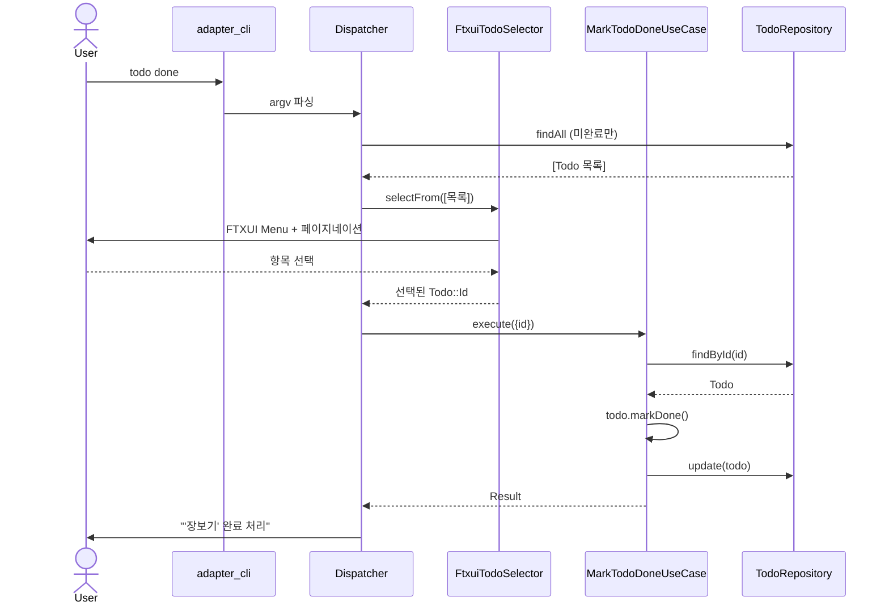

# 02. Todo 완료 (인터랙티브 선택 B 패턴)

**UseCase:** `MarkTodoDoneUseCase` + `TodoSelector` (port)

사용자가 `todo done` 인자 없이 실행. 시스템이 미완료 Todo 목록을 표시하고 사용자가 키보드로 선택하면 그 Todo 를 완료 처리. ID 사용자 비노출 (B 패턴, D 결정).

**핵심 단계:**
- ID 사용자 비노출 (UUID 가 내부 PK)
- FTXUI Menu 가 페이지네이션 자동 처리 (D 결정)
- 같은 패턴이 `todo update/delete`, `event update/delete`, `goal log/update/delete/show` 에 적용됨
- 목록 가져올 때 `findAll(미완료만)` — 완료된 Todo 는 처음부터 제외 (UX)
