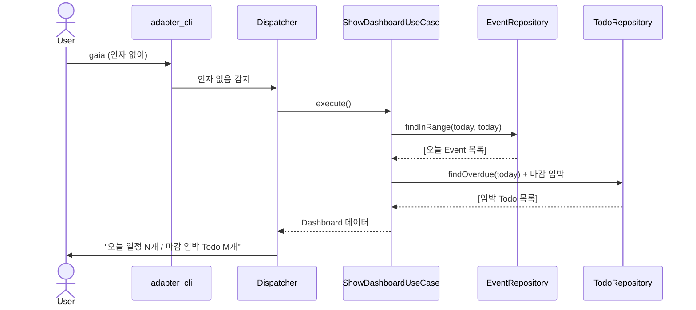

# 03. Dashboard (인자 없이 실행, F8)

**UseCase:** `ShowDashboardUseCase`

사용자가 인자 없이 `gaia` 실행 → 오늘 일정 개수 + 마감 임박 Todo 개수 자동 표시.

**핵심 단계:**
- 진입점에서 argv 가 비어있으면 자동 Dashboard 진입 (CLI11 의 fallback subcommand 활용)
- 임박 기준 정의 필요 (예: 오늘부터 N일 이내) — 구현 단계에서 결정 또는 설정 파일로 노출
- Repository 두 개 호출 (Event + Todo) — 둘 다 인덱스 활용 (NF1 대응)
