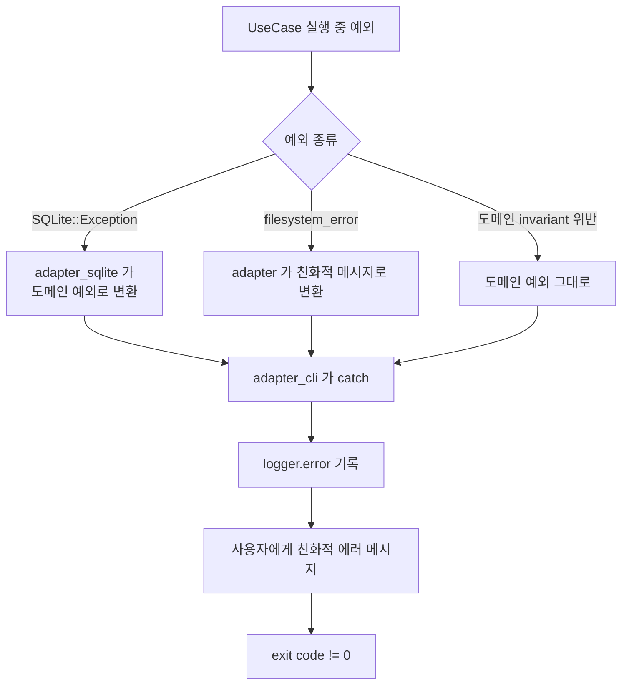

# 99. 에러 처리 흐름

UseCase 실행 중 예외 발생 시 처리 경로. adapter 가 외부 시스템 예외를 도메인 예외로 변환하고, `adapter_cli` 가 최종 catch 하여 친화적 메시지로 사용자에게 안내.

**핵심 정책:**
- 외부 시스템 예외 (SQLite, filesystem) 는 어댑터에서 도메인 예외로 변환 — core 가 외부 예외 type 을 모름 (헥사고날 정책: 외부 의존성 격리)
- `adapter_cli` (driving) 가 최종 catch 지점 — main 에서 미처리 예외 전부 잡음
- 모든 에러 `logger.error` 로 기록 (디버그 추적용, F9)
- 사용자에게는 친화적 메시지 (스택 트레이스 노출 X)
- exit code != 0 (스크립트 chain 에서 검출 가능)
