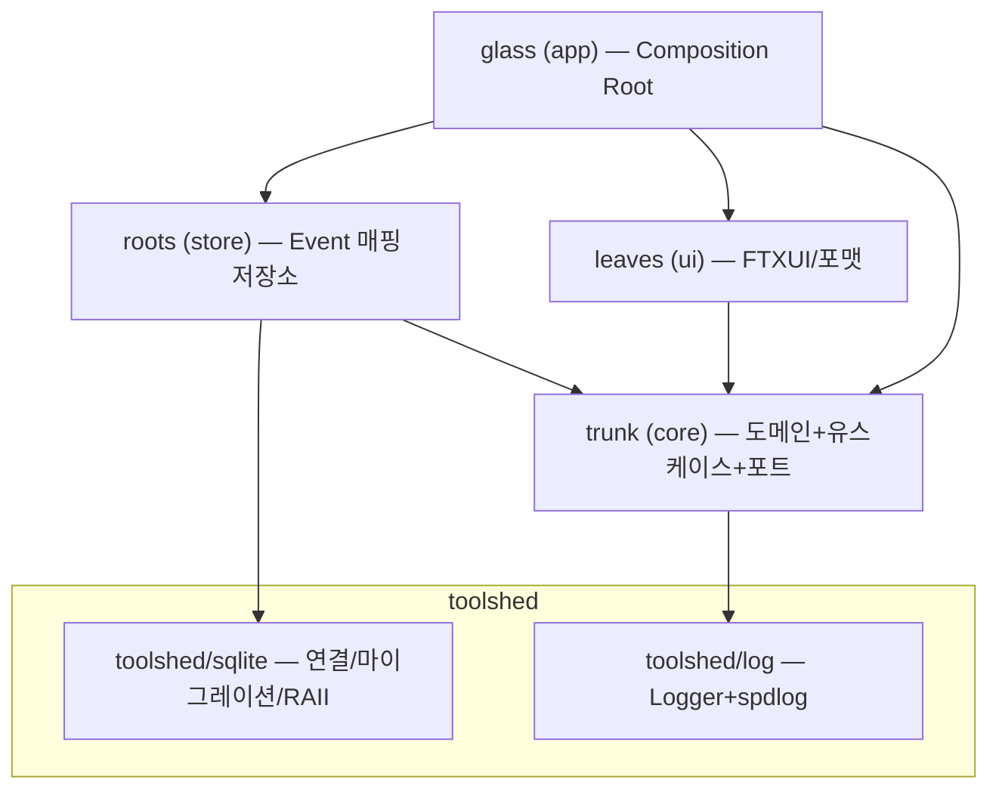
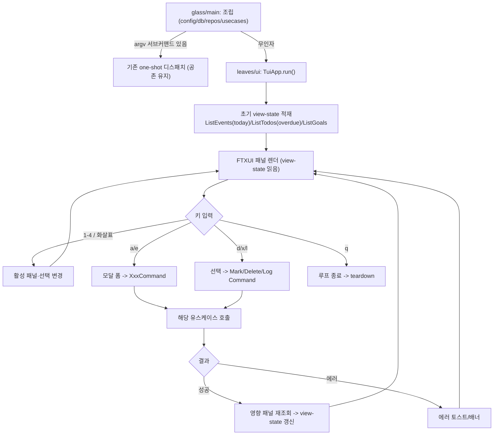
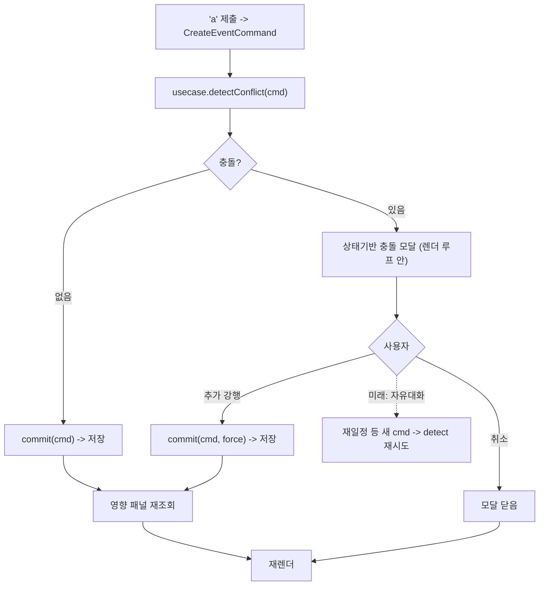

# 설계: 일정관리툴 — 상주 FTXUI TUI 재설계 (v2)

> **02 설계 확정 (2026-06-09).** 흐름 B3 재설계. 완료 기준 체크리스트 승인됨(`2026-06-09-2033-checklist.md`). 3단계(구현) 입력으로 사용한다.
>
> v1(원샷 CLI, 현재 as-built) 설계 전체는 `archive/handoff-2026-06-09-0935.md` 참조. 도메인/코어 인터페이스·결정은 v1과 동일하며 코드(현 `seed/stem/stomata`, 목표 `trunk`)에 존재한다. 본 v2 문서는 **바뀌는 것(구조·UI·충돌 흐름)** 을 상세화하고, **안 바뀌는 코어** 는 코드/archive 참조로 둔다.

---

## 1. 적용 흐름

**B (기존 코드 변경) — 세부 B3 (기능 추가 + 리팩터링).**

- **기능 추가**: 원샷 CLI(명령 1회 실행 후 종료) -> 구동이 유지되는 전체화면 FTXUI 대시보드 TUI.
- **리팩터링**: 디렉토리/모듈 재구성 — 헥사고날 8분할을 역할 모듈로 합치고, 도메인-무관 인프라를 공유 모듈 `toolshed`로 추출.

**사유**: 01의 "현재 상태 N/A(신규)"가 아니라, 이미 138 테스트 green인 as-built 위에서 동작 확장 + 구조 개편을 동시 수행. facet 분석(`analyze/facet/`)을 현재 구조 입력으로 사용(스킬 신규 규칙대로).

---

## 2. 현재 상태 (as-built)

- 헥사고날 8 모듈: `seed/stem/stomata/roots/rings/climate/leaves/glass` + `nutrients`(벤더). 빌드 타깃 `planning_core / planning_roots / rings / climate / leaves` + 실행파일 `gaia`.
- `glass/main.cpp` = 거대 Composition Root + if/else 디스패치. argv 1회 파싱 -> 유스케이스 1회 -> 출력 -> **종료(one-shot)**. 예외는 top-level catch -> stderr + exit 1.
- event/todo/goal CRUD + `init` + dashboard 동작, 테스트 **138 green**.
- 상세 구조: `analyze/facet/architecture.md`·`flow.md`. v1 설계 전체: `archive/handoff-2026-06-09-0935.md`.

---

## 3. 모듈 구조 (target)

### 3-1. 원칙

"무조건 합치기"가 아니라 **엉킨 건 쪼개고, 과하게 쪼갠 건 합친다**.

- `seed+stem+stomata` -> 과하게 쪼개진 "두뇌"라 **하나(`trunk`)로 합침**.
- `roots`(sqlite 어댑터) -> 범용 플럼빙 + Event 매핑이 **엉켜 있어 쪼갬** (`toolshed/sqlite` + `roots`).

### 3-2. 워크스페이스 지형

```
Terrarium/                      git repo (전체 한 repo)
├── orchard/                    앱 우산 (구 fruit 가칭)
│   └── CLI_Planning/           이 앱 (이름 유지, 추후 재고)
│       └── src/
│           ├── trunk/          core: 도메인+유스케이스+포트 (구 seed+stem+stomata)
│           ├── roots/          store: 도메인-인지 sqlite 저장소 (Event 매핑)
│           ├── leaves/         ui: FTXUI 화면 + CLI 출력 포맷 + 프롬프트
│           └── glass/          app: 진입점 + 조립 (Composition Root)
└── toolshed/                   공유 범용 인프라 (구 kit 가칭, fruit와 형제)
    ├── sqlite/                 연결/WAL/마이그레이션/RAII 래퍼 (구 roots의 범용 절반)
    └── log/                    Logger 인터페이스 + spdlog 구현 (구 rings)
```

의존 방향: `glass -> roots/leaves -> trunk -> toolshed`. `toolshed`가 맨 아래(도메인-free), `orchard` 안을 절대 모름. 순환 없음.

### 3-3. 이름 매핑

| 새 이름 | 역할 | 구 이름 | 비고 |
|---|---|---|---|
| `orchard/` | 앱 우산(여러 앱) | (없음) | 나무들이 선 정원 구역. Terrarium보다 한 단계 아래 |
| `toolshed/` | 공유 범용 인프라 | (없음) | 키퍼의 도구창고. 도메인-free, 추출 준비 완료 구역 |
| `trunk/` | 도메인+유스케이스+포트 | seed+stem+stomata | 줄기 — roots/leaves가 붙는 중심 몸통 |
| `roots/` | 도메인-인지 저장소 | roots(의 도메인 절반) | substrate에서 흡수·저장 |
| `leaves/` | UI(FTXUI+포맷) | leaves | 빛·공기(사용자 입력) 수용 |
| `glass/` | 진입점·조립 | glass | 전체를 담아 조립하는 그릇 |
| `toolshed/sqlite` | sqlite 범용 플럼빙 | roots(의 범용 절반) | 연결/WAL/마이그레이션/RAII |
| `toolshed/log` | Logger + spdlog | rings | — |
| (앱쪽 잔류) `climate` | 설정 로딩(toml++) | climate | config는 9할이 앱 스키마라 toolshed 미추출 |

### 3-4. 재사용 경계 기준

추출 가능 여부 = **"그 코드가 도메인(Event/Todo/Goal)을 아는가."**

- 모르는 범용 코드(sqlite 연결관리, spdlog 로거) -> `toolshed`로 추출. 나중에 `toolshed`를 위로 `mv`하면 형제 앱이 공유(지금은 Terrarium 안 공유).
- 아는 코드(SqliteEventRepository = Event 매핑) -> 앱(`roots`)에 잔류.
- "외부 라이브러리를 쓰는가"만으로 판단하면 오판(config가 toml++ 쓰지만 범용 알맹이 ~1줄) -> **실제 코드의 범용 알맹이 크기를 확인**.

### 3-5. 의존 다이어그램



### 3-6. 네임스페이스 스킴

원칙: **독립 코드 단위마다 자기 루트 네임스페이스, 조직용 우산 디렉토리(orchard)는 ns에 안 들어감.** OSS는 자기 upstream ns 유지(`SQLite::`/`spdlog::`/`toml::`/`ftxui::`/`uuids::`...), `nutrients/`는 스킴 밖.

| 디렉토리 | 네임스페이스 |
|---|---|
| trunk/domain | `planning::domain` |
| trunk/usecase | `planning::application` |
| trunk/ports | `planning::ports` |
| roots | `planning::store` |
| leaves | `planning::ui` |
| glass | `planning::app` |
| climate | `planning::config` |
| toolshed/sqlite | `toolshed::sqlite` |
| toolshed/log | `toolshed::log` |

`planning::`(앱)과 `toolshed::`(공유)는 형제 루트. 미래 앱 beta는 `beta::`(orchard:: 안 붙음). 뎁스 3 유지(`planning::domain::Event`, `toolshed::sqlite::Database`).

---

## 4. 인터페이스 명세

### 4-1. 불변 (코어)

도메인(`Event/Todo/Goal/TimeRange/RecurrenceRule/Priority/ConflictDetector/IdGenerator`)과 저장소/ConfigLoader 포트 시그니처는 **v1과 동일**. 코드 및 `archive/handoff-2026-06-09-0935.md` 4-1/4-2 참조. 디렉토리만 `seed/stem/stomata -> trunk`로 이동, 네임스페이스는 3-6.

### 4-2. 변경 — 충돌 2-phase (단일 execute + force)

`CreateEventUseCase`/`UpdateEventUseCase`에서 `ConflictPrompter` 의존 제거. **단일 `execute(cmd, force=false)` + 판별 Result**:

```cpp
namespace planning::application {
struct CreateEventResult {
    std::optional<domain::Conflict>  conflict;   // set -> 충돌로 미저장
    std::optional<domain::Event::Id> createdId;  // set -> 저장됨
};
class CreateEventUseCase {
public:
    CreateEventUseCase(ports::EventRepository&, const domain::ConflictDetector&,
                       domain::IdGenerator&, toolshed::log::Logger&);  // ConflictPrompter 없음
    CreateEventResult execute(CreateEventCommand cmd, bool force = false);
};
}
```

- `execute(cmd)`(force=false): 검증 -> 감지 -> 충돌이면 `{conflict}`(미저장), 아니면 저장 `{createdId}`.
- `execute(cmd, true)`: 검증 -> 저장(감지 생략).
- **세 갈래**: 성공(`createdId`) / 충돌(`conflict`, 정상 반환 -> 되묻기) / 입력 무효(throw -> 에러). **충돌은 예외 아님**(정상 분기).
- `UpdateEvent` 동일(`UpdateEventResult{conflict, updated}`, 시간 변경 시만 재검사). 비충돌 유스케이스는 v1 그대로.

### 4-3. 신규 — toolshed/sqlite (얇게, 라이프사이클만)

```cpp
namespace toolshed::sqlite {
class Database {                              // RAII + WAL/foreign_keys/busy_timeout PRAGMA
public:
    static Database open(const std::filesystem::path& dbPath);
    SQLite::Database& handle();               // store가 SQLiteCpp로 직접 SQL
};
class MigrationRunner {                       // 메커니즘만 (디렉토리 적용 + schema_version)
public:
    explicit MigrationRunner(Database&);
    void run(const std::filesystem::path& migrationsDir);
};
}
```

라이프사이클(열기/마이그레이션/RAII)만 공유. SQL 추상화 안 함(`handle()`로 SQLiteCpp 노출, store는 DB 어댑터라 수용). `.sql`은 앱(`seasons/`). 두껍게(자체 Statement API)는 SQLiteCpp 재발명 + 포트가 이미 격리라 과잉 -> 기각.

### 4-4. 신규 — toolshed/log (범용 Logger facade)

```cpp
namespace toolshed::log {
struct Config {                              // toolshed 자체 범용 Config (앱 무관)
    std::string name;                        // 주체별 고유 식별자 (spdlog 레지스트리 충돌 방지)
    std::filesystem::path path;
    std::string level; bool audit; std::string rotation;
    int debugRetentionDays, auditRetentionDays; bool separateDebugAudit;
};
class Logger {                               // v1 planning::ports::Logger 이주
public:
    virtual ~Logger() = default;
    virtual void debug(const std::string&) = 0;
    virtual void info (const std::string&) = 0;
    virtual void warn (const std::string&) = 0;
    virtual void error(const std::string&) = 0;
    virtual void audit(const std::string& action, const std::string& detail) = 0;
};
class SpdlogLogger : public Logger {
public:
    static std::unique_ptr<Logger> create(const Config&);
};
}
```

`Logger` 인터페이스를 toolshed에 둠 (**(A) 범용 facade**) -> trunk가 `toolshed::log::Logger` 의존. 로깅은 cross-cutting facade라 허용(SLF4J식). (B)포트 유지=재사용 깨짐, (C)브리지=과함 -> 기각. **인스턴스-per-주체**(싱글톤 아님): 각 주체가 자기 Config(자기 name/path)로 만들어 독립 파일. 앱(`planning::config`)이 TOML -> Config 매핑.

### 4-5. 신규 — ui/TuiApp

```cpp
namespace planning::ui {
struct UseCases {                            // 16개 개별 인자 대신 묶음 주입
    application::CreateEventUseCase&  createEvent;
    application::ListEventsUseCase&   listEvents;
    // ... todo/goal CRUD + LogGoal + ShowDashboard 전부
};
class TuiApp {
public:
    TuiApp(UseCases usecases, toolshed::log::Logger& logger);
    int run();                               // FTXUI 루프, 종료코드 (q 또는 fatal)
};
}
```

내부(구현, 명세 외): 패널(Today/Events/Todos/Goals) + 모달(입력 폼/충돌) + view-state + 포커스/선택.

**포트 2개 제거**(대시보드 모델의 단순화):
- `ConflictPrompter` 제거 — (가) 2-phase에서 유스케이스가 prompter를 안 부름. 충돌은 `Result.conflict`로 와서 TuiApp이 인라인 모달(CLI는 main이 `[y/N]`). 포트 자체 불필요.
- `TodoSelector/EventSelector/GoalSelector` 제거 — 선택이 대시보드 패널 안(FTXUI Menu)으로 흡수. TuiApp이 선택 -> id 내부 해소.

### 4-6. 보류 (의식적) — 자연어 파서

seam = "입력 -> Command DTO"는 **이미 존재**(Command DTO들이 그것). 폼이 Command 직접 채움(현 슬라이스), 자연어(미래)는 같은 Command 생성. **지금 투기적 파서 인터페이스를 만들지 않음** — async/의도분류/스트리밍 등 LLM-의존 부분이라 그때 현실에 맞춰 정의. 교차검증 통과(함정 없음). 알려진 LLM-단계 고려사항: NL은 "타입 모르는 Command"를 내므로 **Command -> 유스케이스 디스패치**가 새로 필요(폼은 패널+키로 회피). 보류 기록 — `code-design-deferral-slot-gap` 메모 + 9장.

---

## 5. 데이터 흐름 (TUI)

> v1의 `flows/NN-*.md`는 원샷 CLI 흐름이라 stale(추후 archive/갱신 대상). 아래가 v2 흐름.

### 5-1. 뼈대



- **유스케이스 주입**: TuiApp이 glass에서 유스케이스 참조를 받음. 코어 불변, leaves/ui만 신규.
- **갱신 모델**: 모든 변경 후 해당 패널 조회 유스케이스 재호출 -> view-state 재구성 -> FTXUI 재렌더. 증분 캐시 없음("변경 시 재조회"), NF1(<200ms 인덱스 조회)이라 비용 작음.

### 5-2. 충돌 흐름 (2-phase, event add/edit 한정)

충돌 = **Event 시간 겹침(도메인)**. Todo/Goal 무관. back-to-back(경계 맞닿음)은 겹침 아님.



점선(자유대화 재일정)은 LLM 단계 경로 — 지금 미구현이나 2-phase라 자리가 비워져 있음. `UpdateEvent`도 이 흐름 공유(수정 시 충돌 재검사).

### 5-3. 입력 검증 (2층)

- **UI 파싱(구문)**: 문자열 -> 타입. 실패 시 **UI에서 종료** — Command 안 만들고 유스케이스 호출 안 함. 해당 필드 인라인 에러, 모달 유지.
- **도메인 불변식(의미)**: 파싱 성공 후 유스케이스 실행 중 도메인이 throw(start>end, 빈 제목, target<=0 등). UI가 catch -> 모달 배너, 모달 유지.
- **원칙**: UI는 도메인 규칙을 복제하지 않음(DRY, 단일 권위). 도메인은 파싱 안 되는 문자열을 영영 못 봄. 성공만 모달 닫음.

### 5-4. 에러 모델 (상주 = 안 죽음)

- **부트스트랩(루프 전)**: config/DB/마이그레이션 에러 -> stderr + 종료(one-shot 그대로, DB 없이 TUI 못 띄움). `init` 거동 동일.
- **루프(TUI 가동 후)**: 모든 액션 핸들러 try/catch -> 에러 표시 + 로그 + **루프 계속**. 종료 조건 = 사용자 q, 또는 FTXUI 렌더/터미널 실패(fatal, 최소집합)뿐. 잡힌 유스케이스/도메인 예외로는 종료 안 함.
- 표시: 모달 액션=모달 배너 / 비모달(d/x/l)=하단 토스트 / 조회 실패=패널 에러 상태. 로깅은 Logger 포트로 그대로.

### 5-5. 포커스 / 액션 컨텍스트

같은 키라도 활성 패널 따라 의미가 달라지고, **하단 액션바가 활성 패널 따라 가변**.

| 패널 | a 추가 | e 수정 | d 완료 | x 삭제 | 기타 | / 필터 |
|---|---|---|---|---|---|---|
| Today | - | - | - | - | 읽기전용 개요 | - |
| Events | O | O | - | O | - | 기간(today/week/range) |
| Todos | O | O | O | O | - | tag/priority |
| Goals | O | O | - | O | `l`: +1 기록 | - |

- Today 읽기전용(중복 조작 방지). Goal `l`=`LogGoalUseCase` 카운터 +1(N/undo는 9-1대로 기각, 모달·충돌 없음).
- 빈 패널: 선택 대상 없으니 `a`만 활성, placeholder 표시.
- 페이지네이션: 명시적 페이지 대신 **패널 내 스크롤**(FTXUI Menu, 선택 따라 스크롤). 각 패널 독립 스크롤.

---

## 6. 비기능 요구사항 대응

- **성능/보안(로컬)/호환성/운영(로깅)/빌드**: v1과 동일. archive 6장 참조.
- **확장성(NF3 어댑터)**: 헥사고날 유지. TUI는 새 driving 어댑터(leaves/ui), 코어 불변.
- **재사용성(신규)**: `toolshed`가 도메인-free 격리 구역. 규칙 — `toolshed`는 `orchard` 안을 절대 import 안 함. 두 번째 소비자 등장 시 `mv`로 상위 추출(재작성 아님). 현재는 Terrarium 내부 공유까지만(전자 미선택, 후자=경계만 깨끗이).

---

## 7. 전환 경로

원칙: (1) 리팩터링으로 자리부터 만들고 그 위에 기능을 얹는다, (2) 매 단계 끝에서 빌드 + 138 테스트 green. "대격변"은 동작 0 변화 이동들의 연속이라 기존 테스트가 가드.

### Phase A — 리팩터링 (동작 불변, 매 단계 138 green)

| 단계 | 내용 |
|---|---|
| A0 | 베이스라인 고정: 미커밋분 커밋 + 138 green 확인 |
| A1 | 최상위 골격: `orchard/` + `toolshed/` + 최상위 CMake, `CLI_Planning` -> `orchard/` 이동(순수 경로) |
| A2 | `trunk` 병합: seed+stem+stomata -> trunk (include/CMake 갱신, 네임스페이스 유지) |
| A3 | `toolshed/log` 추출: rings + Logger 인터페이스 (cross-dir 빌드 첫 확립, 쉬운 것부터) |
| A4 | `toolshed/sqlite` 추출 + `roots` 분리 (가장 위험 — 새 추상화 경계 작성). 하위 분할: |
| A4a | 범용 플럼빙(연결/마이그레이션/RAII)을 toolshed/sqlite로 얇게 추출, 저장소는 그대로 통과 |
| A4b | 저장소를 새 경계 경유 재배선 — **Event 하나만** 먼저(통합 테스트로 가드) |
| A4c | Todo/Goal 저장소 동일 패턴 |
| A5 | 잔정리: config(climate) 자리 확정, leaves->ui 정착, namespace/gaia 제거 착수 |
| A6 | 충돌 흐름 2-phase 역전(CLI 동작 보존, 테스트 green). Phase B의 다리 |

-> **A6 끝 = 목표 레이아웃 완성. one-shot CLI 그대로, 138 green. 출하 가능 마일스톤.** 동작은 한 톨도 안 바뀜.

### Phase B — 기능 (TUI 얹기, CLI 공존)

| 단계 | 내용 |
|---|---|
| B1 | 상주 루프 골격: `gaia` 무인자 -> 루프 진입(최소), argv 서브커맨드 공존 유지 |
| B2 | FTXUI 대시보드 읽기: 패널 뷰, 기존 조회 유스케이스 재사용, 쓰기 없음 |
| B3 | 입력 모달 + 쓰기: a/e/d/x/l -> Command -> 유스케이스, 2-phase 충돌 |
| B4 | 파서 포트 seam: 자연어 파서 포트 자리만(보류 기록) |

**롤백**: 각 단계 독립 커밋. 문제 시 해당 단계만 revert. A 단계는 전부 동작 보존이라 revert해도 기능 손실 없음.

---

## 8. TDD 계획

단위 = 모듈 공개 인터페이스. happy -> 실패 -> edge 순. 코드 스켈레톤 없음. B3라 **A(회귀 방지) + B(신규)** 두 묶음 + TUI는 GUI 경계라 단위 제외 -> **C(수동 QA)**.

### 8-A. 회귀 방지 (리팩터링 가드)

**8-A-1. 손 안 대는 것** — v1 138 중 계약 불변 전부. A1~A6 리팩터링이 green 유지하는지로 검증(케이스 불변, include/namespace 같은 배선만 기계적 수정 허용, 재작성 없음):
- 도메인 전부(TimeRange/Event/Todo/Goal/ConflictDetector)
- 비충돌 유스케이스(DeleteEvent, ListEvents, Todo 5종, Goal 6종, ShowDashboard)
- 어댑터(Sqlite 저장소 3종=`toolshed::sqlite::Database` 경유, TomlConfigLoader, ArgParser+Dispatcher), E2E 3흐름
- 이주만 되는 `MigrationRunner`/`SpdlogLogger`의 **기존** 케이스도 여기(가드). 새 표면은 8-B-3/8-B-4.
- 상세 케이스는 `archive/handoff-2026-06-09-0935.md` 8장.

**8-A-2. 계약 변경 -> 폐기 후 B로 대체** — ConflictPrompter 제거로 시그니처 바뀌는 `CreateEvent`/`UpdateEvent`. prompter 충돌 케이스 3개(`returns_id_on_user_accept_conflict`, `returns_cancelled_on_user_decline_conflict`, `returns_cancelled_on_user_decline_after_change`) 폐기. 비충돌 케이스 포함 전체 재명세는 8-B-1/8-B-2(반환 `id`->`createdId`).

### 8-B. 신규 (Phase B 단위, 전부 공개 API)

**8-B-1. `CreateEventUseCase.execute`** (2-phase, force 분기; 충돌=Result 분기/예외 아님, 불변식=throw)

| 구분 | 케이스 |
|---|---|
| happy | `no_conflict_persists_and_returns_createdId`, `with_recurrence_sets_rule`, `overlap_returns_conflict_unsaved`(force=false, 미기록), `force_commits_despite_overlap` |
| 실패 | `invalid_time_range_throws`, `empty_title_throws` |
| edge | `all_day_no_end_persists`, `back_to_back_not_conflict`, `force_with_no_overlap_persists_normally` |

**8-B-2. `UpdateEventUseCase.execute`** (2-phase, 시간 변경 시만 재검사)

| 구분 | 케이스 |
|---|---|
| happy | `non_time_change_persists_without_recheck`, `time_change_no_overlap_persists`, `time_change_overlap_returns_conflict_unsaved`, `force_commits_despite_overlap` |
| 실패 | `throws_when_not_found`, `invalid_time_range_throws` |
| edge | `partial_update_only_changed_fields`, `back_to_back_after_move_not_conflict` |

**8-B-3. `toolshed::sqlite::Database`** (신규 라이프사이클 래퍼; MigrationRunner는 이주=가드)

| 구분 | 케이스 |
|---|---|
| happy | `open_creates_and_opens_db_file`, `open_applies_wal_foreign_keys_busy_timeout`, `handle_exposes_sqlitecpp_for_direct_sql` |
| 실패 | `open_throws_on_unwritable_path` |
| edge | `open_existing_file_reuses`, `raii_releases_connection_on_scope_exit` |

**8-B-4. `toolshed::log::SpdlogLogger::create`** (신규 표면 = name 기반 독립 인스턴스; sink/로테이션/fallback은 가드)

| 구분 | 케이스 |
|---|---|
| happy | `create_from_config_returns_logger`, `distinct_names_write_independent_files`, `config_drives_path_and_level` |
| edge | `same_name_reused_no_registry_collision`, `audit_disabled_omits_audit_sink` |

### 8-C. 수동 QA (TUI, 단위 아님)

TuiApp은 GUI 환경 경계라 단위 테스트 제외, 사용자 인수 테스트(UAT)로 검증. 체크리스트 -> **`qa-checklist.md`** (키 컨텍스트/충돌 모달/입력 검증/에러 루프 생존/빈 상태·스크롤/종료, 5장 흐름 1:1). 표현 로직 seam을 나중에 추출하면 해당 항목은 거기서 8-B로 이전.

---

## 9. 설계 결정 기록 (원장 — v1 이어받음 + v2 누적)

### 9-v1. v1 결정 (요약, 상세 archive 9장)

Event Aggregate β / Goal counter(+1, undo 기각) / Todo 태그 list / UUID 내부+B패턴 / 16 UseCase 액션별 분리 / SQLiteCpp·CLI11·FTXUI·spdlog·stduuid·toml++·GoogleTest1.17 / WAL / INTEGER(unix epoch) 시간 / 인덱스 5 / 마이그레이션 자동. **모두 v2에서 유지**(도메인/인프라 불변).

### 9-v2. v2 결정 (이번 재설계)

| 결정 | 채택 | 사유 | 기각 대안 |
|---|---|---|---|
| UI 형태 | 전체화면 대시보드 TUI(lazygit식) | "구동 유지 + 여러 입력" = 상주 UI | 메뉴 드릴다운, 상주 REPL |
| 입력 방식 | 모달 폼 (현 슬라이스) | LLM API 현 범위 밖. Command seam이라 자연어로 저비용 전환 | 하단 명령줄, 자연어 즉시(보류) |
| 자연어 파서 | **보류**(포트 자리만) | 후속 슬라이스, 같은 Command seam | (의식적 보류, 9장에 기록) |
| 디렉토리 | 역할 모듈(trunk) + toolshed(sqlite/log) 추출 | 엉킨 건 쪼개고 과분할은 합침. 재사용 경계=도메인 인지 | 외부 전부 한 디렉토리(범용+도메인 재엉킴) |
| config 위치 | 앱쪽 잔류(climate) | 코드 9할이 앱 스키마, 범용 알맹이 ~1줄 | toolshed 추출(도메인 누수) |
| 워크스페이스 | Terrarium/{orchard, toolshed} | 한 repo 내 공유, repo 경계 회피 | kit를 repo 밖 형제로(submodule 복잡) |
| 공유 범위 | 후자(경계만, 추출은 나중) | 두 번째 소비자 등장 시 mv | 전자(지금 별 repo 추출) |
| 충돌 흐름 | (나) 2-phase 역전(detect/commit) | FTXUI 단일 루프 + LLM 대화 양쪽에 맞음. 동기 콜백은 둘 다 깨짐 | (가) ConflictPrompter 동기 콜백 유지 |
| CLI 운명 | 공존(무인자=TUI, argv=one-shot 유지) | 스크립트/자동화 보존, 전환 안전 | 완전 대체(자동화 상실, init 곤란) |
| 에러 모델 | 부트스트랩 exit / 루프 per-action 계속 | 상주는 한 액션 에러로 안 죽음 | top-catch-exit(원샷 그대로) |
| 검증 분담 | UI=파싱 / 도메인=불변식 throw | DRY, 단일 권위 | UI가 불변식 선검사(규칙 복제) |
| 네임스페이스 | 독립단위=루트(`planning::`/`toolshed::`), 우산(orchard) ns 제외 | 독립 앱/공유lib는 형제 루트, 우산은 코드단위 아님 | 경로 전체 미러(`orchard::CLI_Planning::...` 과깊음) |
| 충돌 API 모양 | (가) 단일 `execute(cmd,force)` + 판별 Result | 비충돌 happy path 1검증, commit 재감지 불필요 | (나) detect/commit 분리(검증 2회, 재감지로 분리 흐려짐) |
| toolshed/sqlite 두께 | 얇게(라이프사이클만, handle()로 SQLiteCpp 노출) | 공유분은 open/migrate/RAII. 포트가 이미 격리 | 두껍게(자체 Statement API = SQLiteCpp 재발명) |
| Logger 인터페이스 위치 | (A) `toolshed::log::Logger` facade + Config.name | 로깅=cross-cutting facade(SLF4J식), 재사용 성립 | (B)코어 포트(재사용 깨짐), (C)브리지(과함) |
| TuiApp 포트 정리 | ConflictPrompter + Selector 3종 제거 | (가)로 prompter 불필요, 선택은 패널 내부 흡수 | v1 포트 유지(대시보드 모델에 불필요) |
| 자연어 파서 인터페이스 | 지금 정의 안 함(seam=기존 Command) | async/의도분류는 LLM-의존, 지금 박으면 틀림 | 투기적 스텁 선정의 |
| TUI 테스트 전략 | GUI 경계라 단위 제외 -> 수동 QA(UAT) | TuiApp=driving 어댑터, run()=인터랙티브 루프라 단위 부적합 | 표현 seam 추출해 리듀서 단위화(현 매핑 무게엔 과함) |

---

## 10. 참고 자료

- v1 외부 출처(SQLite/CLI11/FTXUI/spdlog/stduuid/toml++/GoogleTest 등): archive 10장.
- FTXUI: <https://github.com/ArthurSonzogni/FTXUI> (대시보드 패널/Menu 스크롤/Modal).
- 내부: `analyze/facet/`(as-built 분석), `archive/handoff-2026-06-09-0935.md`(v1 설계).

---

## 11. 사용자와의 명확화 기록 (원장 — v1 #1~16 + v2 #17~)

### 11-v1 (요약, 상세 archive 11장)

#1 저장경로 / #2 Event Aggregate β / #3 단일 BC / #4 추정 UseCase 5개 추가 / #5 F5 id->B패턴 / #6 ID 목적·UUID / #7 헥사고날 라이브러리 GUI 운명 / #8 GUI 키보드 입력=자연어(LLM) / #9 설정파일 위치 / #10 설정 default 부재 / #11 TOML / #12 GoogleTest Abseil / #13 헥사고날 wip 부재 / #14 핸드오프 draft 검토 / #15 데이터흐름 flows 분리 / #16 Terrarium 테마 명명.

### 11-v2 (이번 세션)

| # | 주제 | 명확화 결과 |
|---|---|---|
| 17 | UI 형태 | "구동 유지 + 여러 입력" = 전체화면 대시보드 TUI(lazygit식) |
| 18 | 입력 방식 / 1->3 전환 | 모달 폼으로 시작, 자연어는 같은 Command seam이라 저비용. 파서 포트는 보류(미구현 자리만) |
| 19 | 디렉토리 불만 / 재사용 | "너무 기능적으로 쪼갬" -> 역할 모듈 병합 + toolshed 추출. 재사용 경계="도메인 인지 여부". config 앱쪽 |
| 20 | 워크스페이스 지형 | Terrarium 하위 orchard(앱 우산)/toolshed(형제). 이름=식물 메타포(trunk/roots/leaves/glass/orchard/toolshed) |
| 21 | 충돌 흐름 가/나 | LLM 대화 입력 관점에서 동기 콜백(가)이 깨짐 -> (나) 2-phase 역전 채택 |
| 22 | 충돌 정의 | Event 시간 겹침(도메인). Todo/Goal 무관. back-to-back 허용 |
| 23 | 입력 검증 분담 | UI=파싱(실패는 UI에서 끝) / 도메인=불변식 throw 잡아 표시. UI는 규칙 복제 안 함 |
| 24 | 에러 모델 | 부트스트랩 exit / 루프 per-action catch+계속(상주 안 죽음), fatal 최소 |
| 25 | Goal log | +1 고정(N/undo는 9-1대로 기각) |
| 26 | 포커스/액션 | Today 읽기전용, 액션바 활성 패널 따라 가변 |
| 27 | 빈 상태/스크롤 | placeholder + 패널 내 스크롤(FTXUI Menu) |
| 28 | 재설계 handoff 처리 | 옛 handoff -> archive 스냅샷, 새 handoff=target 본문+원장 이어받기. 스킬 #3에 archive 예외 보강 |
| 29 | 네임스페이스/타입 정리 시점 | 설계단계에서 정리 적합(시그니처 전제). 독립단위=루트, 우산 ns 제외, OSS 자기 ns. 래퍼는 우리 코드라 toolshed:: |
| 30 | 충돌 API 모양 | (가) 단일 execute+force로 교차검증 후 확정. 충돌=Result(예외 아님), 무효=throw, parse=UI 3층 |
| 31 | toolshed/sqlite 두께 | 두껍게 이점 검토(벤더격리/에러변환/재사용/테스트) 후 얇게 채택. store가 DB어댑터라 SQLiteCpp 수용 |
| 32 | Logger 범용성 + 식별자 | (A) facade로 최대 범용. 인스턴스-per-주체로 독립(다른 파일), Config.name으로 spdlog 레지스트리 충돌 방지 |
| 33 | 불필요 포트 제거 | ConflictPrompter/Selector 제거 동의 ("불필요한 건 제거가 맞음") |
| 34 | 파서 보류 교차검증 | 함정/seam깊이/async/충돌정합 4각 검증 통과. LLM 때 Command->유스케이스 디스패치 필요(고려사항 기록) |
| 35 | TUI 테스트 범위 | GUI 영역은 단위 테스트 힘드니 사용자 E2E/QA로(QA처럼). 리듀서 seam 강제 추출 안 함. TDD=A 회귀/B 신규 단위, C=수동 QA(qa-checklist.md) |

---

## 12. 구현 이탈 기록 (v1 원장 — 상세 archive 12장)

v1 03 단계 이탈 5건(빌드타깃명, UX B->A `--id`, FTXUI 셀렉터 보류, leaves ArgParser/Dispatcher 인라인, JSON 미도입)은 `archive/handoff-2026-06-09-0935.md` 12장 보존. v2에서 상당수가 본 재설계로 해소/재정의됨(예: FTXUI 셀렉터=B2 대시보드, `--id`=B패턴 인터랙티브 선택으로 복귀). v2 진행 중 발생하는 새 이탈은 본 섹션에 누적.

---

> 02 설계 확정. 다음 단계: 03 구현 — Phase A(리팩터링, 매 단계 138 green)부터 시작해 Phase B(TUI 얹기)로.
