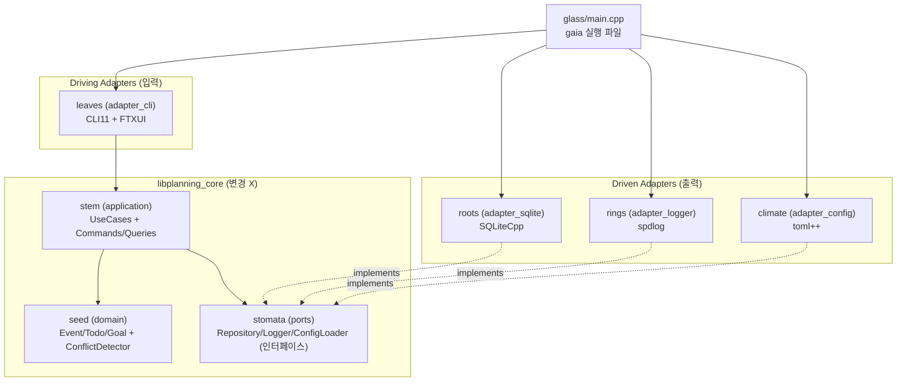

# 설계: CLI 기반 일정 관리툴 (Kyklos Gaia / CLI_Planning)

> **확정 핸드오프** — 체크리스트(2026-05-31-1940) 사용자 승인 완료. 03 구현 단계에서 Terrarium 테마 디렉토리 명명 개정 반영 (11장 #16).

---

## 1. 적용 흐름

**A. 새 프로젝트** — 신규 C++ CLI 일정 관리툴.

**사유:** 01 요구사항 "현재 상태: N/A (신규 프로젝트)" 와 일치. 기존 코드 없음, 도메인 + 어댑터 구조를 처음부터 설계.

---

## 2. 현재 상태

N/A — 신규 프로젝트이므로 기존 코드 없음.

---

## 3. 모듈 구조

**분할 기준:** Hexagonal (Ports & Adapters) — 외부 시스템(SQLite, CLI, 로거, 설정 파일)을 어댑터 안에 격리, 도메인은 외부를 모름. NF3 (어댑터 확장 정책) 충족.

### 3-1. 모듈 목록 + 책임

> **Terrarium 테마 디렉토리 명명** (개정 — 11장 #16 참조): 디렉토리 이름을 식물 부위/외부 투입물 은유로 교체. 헥사고날 구조·책임·인터페이스 시그니처·결정은 불변. 코드 네임스페이스(`planning::domain` 등)와 빌드 타깃 이름은 본 초안 단계에서 그대로 유지(복기 시 재정비 가능).

| 디렉토리 (구 이름) | 역할 | 은유 | 빌드 타깃 |
|---|---|---|---|
| `seed/` (domain) | Entity (Event, Todo, Goal), VO (TimeRange, Priority), Domain Service (ConflictDetector), 도메인 인터페이스 (IdGenerator) | 생명의 설계도·정체성, 가장 안쪽 | `libplanning_core` |
| `stem/` (application) | UseCase (16개), Command/Query 객체 | 줄기 — 도메인↔외부 신호·양분 전달 | `libplanning_core` |
| `stomata/` (ports) | Repository / Logger / ConfigLoader 인터페이스 (구현은 어댑터에) | 기공 — 외부와 교환하는 인터페이스 구멍 | `libplanning_core` |
| `roots/` (adapter_sqlite) | EventRepository / TodoRepository / GoalRepository 구현, MigrationRunner (SQLiteCpp 사용) | 뿌리 — substrate에서 데이터 흡수·저장 | `libplanning_adapter_sqlite` (driven) |
| `leaves/` (adapter_cli) | ArgParser (CLI11), InteractiveSelect (FTXUI), Dispatcher (Command 변환 + UseCase 호출) | 잎 — 빛·공기(사용자 입력) 수용 | `libplanning_adapter_cli` (driving) |
| `rings/` (adapter_logger) | Logger 구현 (spdlog) | 나이테 — 성장 이력(감사·디버그 로그) | `libplanning_adapter_logger` (driven) |
| `climate/` (adapter_config) | ConfigLoader 구현 (toml++) | 기후 — 자라는 환경 조건(설정) | `libplanning_adapter_config` (driven) |
| `glass/main.cpp` (main) | 진입점, 위 라이브러리 조립 + 의존성 주입 | 유리병 — 전체를 담아 조립하는 그릇 | `gaia` 실행 파일 |

### 3-2. 디렉토리 구조

```
CLI_Planning/
├─ src/
│  ├─ seed/                   (domain)
│  ├─ stem/                   (application)
│  │  ├─ commands/
│  │  └─ queries/
│  ├─ stomata/                (ports)
│  ├─ roots/                  (adapter_sqlite)
│  ├─ leaves/                 (adapter_cli)
│  ├─ rings/                  (adapter_logger)
│  ├─ climate/                (adapter_config)
│  └─ glass/
│     └─ main.cpp             (Composition Root)
├─ nutrients/                 (외부 의존성, NF6 in-tree vendoring)
│  ├─ SQLiteCpp/
│  ├─ CLI11/
│  ├─ FTXUI/
│  ├─ nlohmann-json/
│  ├─ json-schema-validator/
│  ├─ spdlog/
│  ├─ stduuid/
│  ├─ toml++/
│  └─ googletest/
├─ seasons/                   (migrations)
│  └─ 001_init.sql
├─ observation/               (tests)
│  ├─ seed/
│  ├─ stem/
│  └─ roots/ (외 adapter_*)
├─ CMakeLists.txt
└─ README.md
```

### 3-3. 의존 관계 (단방향, 순환 없음)



**의존 방향 규칙:**

- core 는 어댑터 / 외부 라이브러리를 절대 import 안 함 — core 헤더는 SQLite, CLI11, spdlog 등에 대해 모름
- adapter 는 core 의 ports 인터페이스를 implement
- main.cpp 만 모든 모듈을 알고 조립 (Composition Root)

→ 미래에 LLM / Voice / GUI 어댑터 추가 시 core 손대지 않음 (NF3 충족).

---

## 4. 인터페이스 명세

### 4-1. Domain Layer (`src/seed/`)

**Event (Aggregate Root):**

```cpp
namespace planning::domain {

class Event {
public:
    using Id = uuids::uuid;

    Event(Id id, std::string title, TimeRange range,
          std::optional<RecurrenceRule> recurrence = std::nullopt);

    Id id() const;
    const std::string& title() const;
    const TimeRange& timeRange() const;
    std::optional<RecurrenceRule> recurrenceRule() const;

    void reschedule(TimeRange newRange);
    void rename(std::string newTitle);
    void setRecurrence(std::optional<RecurrenceRule> rule,
                       std::optional<std::chrono::sys_seconds> until);
};

}
```

**TimeRange (Value Object, 불변):**

```cpp
class TimeRange {
public:
    TimeRange(std::chrono::sys_seconds start,
              std::optional<std::chrono::sys_seconds> end,
              bool allDay = false);   // start <= end 불변식 검증

    std::chrono::sys_seconds start() const;
    std::optional<std::chrono::sys_seconds> end() const;
    bool isAllDay() const;

    bool overlaps(const TimeRange& other) const;
};
```

**Todo (Aggregate Root):**

```cpp
enum class Priority { HIGH, MEDIUM, LOW };

class Todo {
public:
    using Id = uuids::uuid;

    Todo(Id id, std::string title, Priority priority,
         std::vector<std::string> tags,
         std::optional<std::chrono::sys_days> due = std::nullopt);

    Id id() const;
    const std::string& title() const;
    bool isDone() const;
    Priority priority() const;
    const std::vector<std::string>& tags() const;
    std::optional<std::chrono::sys_days> dueDate() const;

    void markDone();
    void rename(std::string newTitle);
    void updatePriority(Priority p);
    void addTag(std::string tag);
    void removeTag(const std::string& tag);
    void setDueDate(std::optional<std::chrono::sys_days> due);
};
```

**Goal (Aggregate Root):**

```cpp
class Goal {
public:
    using Id = uuids::uuid;

    Goal(Id id, std::string name, int targetValue, std::string unit,
         std::chrono::sys_days periodStart, std::chrono::sys_days periodEnd);

    Id id() const;
    const std::string& name() const;
    int targetValue() const;
    int currentValue() const;
    const std::string& unit() const;
    std::chrono::sys_days periodStart() const;
    std::chrono::sys_days periodEnd() const;

    void incrementCounter();  // +1
    void rename(std::string newName);
    void updateTarget(int newTarget);
    void updatePeriod(std::chrono::sys_days start, std::chrono::sys_days end);

    double progressRatio() const;
};
```

**ConflictDetector (Domain Service):**

```cpp
struct Conflict {
    Event::Id existingEventId;
    std::string existingTitle;
    TimeRange existingRange;
};

class ConflictDetector {
public:
    std::optional<Conflict> detect(const TimeRange& candidate,
                                    const std::vector<Event>& existingOverlapping) const;
};
```

**IdGenerator (Domain 추상 + stduuid 구현):**

```cpp
class IdGenerator {
public:
    virtual ~IdGenerator() = default;
    virtual uuids::uuid next() = 0;
};
```

### 4-2. Ports (`src/stomata/`)

```cpp
namespace planning::ports {

class EventRepository {
public:
    virtual ~EventRepository() = default;
    virtual std::optional<domain::Event> findById(domain::Event::Id) const = 0;
    virtual std::vector<domain::Event> findOverlapping(const domain::TimeRange&) const = 0;
    virtual std::vector<domain::Event> findInRange(std::chrono::sys_days start,
                                                    std::chrono::sys_days end) const = 0;
    virtual std::vector<domain::Event> findAll() const = 0;
    virtual void save(const domain::Event&) = 0;
    virtual void update(const domain::Event&) = 0;
    virtual void remove(domain::Event::Id) = 0;
};

class TodoRepository {
public:
    virtual ~TodoRepository() = default;
    virtual std::optional<domain::Todo> findById(domain::Todo::Id) const = 0;
    virtual std::vector<domain::Todo> findByDueDate(std::chrono::sys_days) const = 0;
    virtual std::vector<domain::Todo> findOverdue(std::chrono::sys_days today) const = 0;
    virtual std::vector<domain::Todo> findByTag(const std::string&) const = 0;
    virtual std::vector<domain::Todo> findByPriority(domain::Priority) const = 0;
    virtual std::vector<domain::Todo> findAll() const = 0;
    virtual void save(const domain::Todo&) = 0;
    virtual void update(const domain::Todo&) = 0;
    virtual void remove(domain::Todo::Id) = 0;
};

class GoalRepository {
public:
    virtual ~GoalRepository() = default;
    virtual std::optional<domain::Goal> findById(domain::Goal::Id) const = 0;
    virtual std::optional<domain::Goal> findByName(const std::string&) const = 0;
    virtual std::vector<domain::Goal> findAll() const = 0;
    virtual void save(const domain::Goal&) = 0;
    virtual void update(const domain::Goal&) = 0;
    virtual void remove(domain::Goal::Id) = 0;
};

class Logger {
public:
    virtual ~Logger() = default;
    virtual void debug(const std::string&) = 0;
    virtual void info(const std::string&) = 0;
    virtual void warn(const std::string&) = 0;
    virtual void error(const std::string&) = 0;
    virtual void audit(const std::string& action, const std::string& detail) = 0;
};

class ConfigLoader {
public:
    struct LogConfig {
        std::filesystem::path path;
        std::string level;              // "DEBUG"/"INFO"/"WARN"/"ERROR"
        bool audit;
        std::string rotationStrategy;   // "daily"/"size"/"none"
        int debugRetentionDays;
        int auditRetentionDays;
        bool separateDebugAudit;
    };

    virtual ~ConfigLoader() = default;
    virtual LogConfig logConfig() const = 0;
    virtual std::filesystem::path dbPath() const = 0;
};

class ConflictPrompter {
public:
    enum class Choice { ADD_ANYWAY, CANCEL };
    virtual ~ConflictPrompter() = default;
    virtual Choice promptOnConflict(const domain::Conflict&) = 0;
};

class TodoSelector {  // (B) 패턴 인터랙티브 선택
public:
    virtual ~TodoSelector() = default;
    virtual std::optional<domain::Todo::Id> selectFrom(const std::vector<domain::Todo>&) = 0;
};
// EventSelector / GoalSelector 동일 패턴

}
```

### 4-3. Application Layer (`src/stem/`)

**Command 객체 예시 (대표 3개, 나머지 동일 패턴):**

```cpp
struct CreateEventCommand {
    std::string title;
    std::chrono::sys_seconds start;
    std::optional<std::chrono::sys_seconds> end;
    bool allDay;
    std::optional<RecurrenceRule> recurrence;
    std::optional<std::chrono::sys_seconds> recurrenceUntil;
};

struct AddTodoCommand {
    std::string title;
    Priority priority;
    std::vector<std::string> tags;
    std::optional<std::chrono::sys_days> due;
};

struct LogGoalCommand {
    std::string goalName;
};
```

→ 16개 UseCase 모두 `XxxCommand` 또는 `XxxQuery` 입력, `Result` 객체 반환. NF4 JSON Schema 는 각 Command/Result 의 직렬화 모양을 명세.

**UseCase 예시 — CreateEventUseCase:**

```cpp
class CreateEventUseCase {
public:
    CreateEventUseCase(ports::EventRepository& events,
                       const domain::ConflictDetector& detector,
                       domain::IdGenerator& idGen,
                       ports::ConflictPrompter& prompter,
                       ports::Logger& logger);

    struct Result {
        std::optional<domain::Event::Id> createdId;
        bool cancelledByUser;
    };

    Result execute(CreateEventCommand cmd);
};
```

### 4-4. Driven Adapters

| 어댑터 | 구현 인터페이스 | 사용 라이브러리 | 주요 책임 |
|---|---|---|---|
| `roots/SqliteEventRepository` | `ports::EventRepository` | SQLiteCpp | SQL 직접 작성, prepared statement, RAII 관리 |
| `roots/SqliteTodoRepository` | `ports::TodoRepository` | SQLiteCpp | 동일 |
| `roots/SqliteGoalRepository` | `ports::GoalRepository` | SQLiteCpp | 동일 |
| `roots/MigrationRunner` | (내부) | SQLiteCpp | `migrations/` 디렉토리 읽고 schema_version 갱신 |
| `rings/SpdlogLogger` | `ports::Logger` | spdlog (fmt 번들) | 디버그 / 감사 분리 sink |
| `climate/TomlConfigLoader` | `ports::ConfigLoader` | toml++ | TOML 파싱 + 검증 |

### 4-5. Driving Adapters

| 어댑터 | 구현 인터페이스 | 사용 라이브러리 | 주요 책임 |
|---|---|---|---|
| `leaves/ArgParser` | (내부) | CLI11 | argv → 서브커맨드 + 옵션 파싱 |
| `leaves/Dispatcher` | (내부) | — | 파싱 결과 → Command 객체 → UseCase 호출 |
| `leaves/CliConflictPrompter` | `ports::ConflictPrompter` | — | stdin/stdout 으로 충돌 안내 |
| `leaves/FtxuiSelector` | `ports::TodoSelector` 등 | FTXUI | 인터랙티브 선택 + 페이지네이션 |

### 4-6. 외부 시스템 연동 정책

| 시스템 | 타임아웃 / 재시도 | 에러 처리 | 테스트 mock |
|---|---|---|---|
| **SQLite** | `PRAGMA busy_timeout=5000` (5초). SQLiteCpp 가 SQLITE_BUSY 내부 재시도 | `SQLite::Exception` → adapter 가 도메인 예외로 변환 | in-memory SQLite (`":memory:"`) 또는 fake Repository 구현 |
| **파일 시스템 (로그/config)** | OS 디폴트 | `std::filesystem::filesystem_error` → 친화적 메시지로 변환 | tmp 디렉토리 / mock ConfigLoader |
| **stdin/stdout (CLI 프롬프트)** | — | EOF / 비TTY 환경 검출 시 자동 취소 | mock ConflictPrompter |

### 4-7. 진입점 (main.cpp, Composition Root)

```cpp
int main(int argc, char** argv) {
    auto config = adapter_config::loadFromCli(argc, argv);
    auto logger = adapter_logger::SpdlogLogger::create(config->logConfig());
    auto db = adapter_sqlite::openDatabase(config->dbPath());  // WAL + 마이그레이션

    adapter_sqlite::SqliteEventRepository eventRepo(db);
    adapter_sqlite::SqliteTodoRepository  todoRepo(db);
    adapter_sqlite::SqliteGoalRepository  goalRepo(db);

    domain::ConflictDetector conflictDetector;
    auto idGen = std::make_unique<domain::StdUuidGenerator>();

    adapter_cli::CliConflictPrompter prompter;
    adapter_cli::FtxuiTodoSelector todoSelector;
    // ...

    application::CreateEventUseCase createEventUC(
        eventRepo, conflictDetector, *idGen, prompter, *logger);
    // ... 16개 UseCase

    adapter_cli::Dispatcher dispatcher(/* UseCase 들 + Selector + logger */);
    return dispatcher.dispatch(argc, argv);
}
```

---

## 5. 데이터 흐름

각 시나리오 상세 다이어그램은 `flows/` 디렉토리 참조.

### 5-1. 시나리오 목록

| 파일 | 시나리오 | UseCase |
|---|---|---|
| `flows/01-event-add-with-conflict.md` | Event 추가 (충돌 발생) | CreateEventUseCase |
| `flows/02-todo-done-interactive.md` | Todo 완료 (인터랙티브 선택 B) | MarkTodoDoneUseCase + TodoSelector |
| `flows/03-show-dashboard.md` | Dashboard 자동 표시 (F8) | ShowDashboardUseCase |
| `flows/99-error-handling.md` | 에러 처리 흐름 | (전역 정책) |

새 시나리오 추가 시 `flows/NN-<topic>.md` 파일로 추가하고 본 표에 한 줄 추가.

### 5-2. 상태 변경 지점

| 지점 | 트리거 |
|---|---|
| SQLite write | Repository.save/update/remove |
| 감사 로그 append | UseCase 진입 + 종료 |
| 디버그 로그 append | UseCase 내부 흐름 + 외부 시스템 호출 |

---

## 6. 비기능 요구사항 대응

| 항목 | 대응 방안 |
|---|---|
| **성능 (NF1, NF2)** | SQLite 인덱스 5개 (D3-C: start_ts, end_ts, due_date, priority, tag), WAL 모드 (D3-A), prepared statement (SQLiteCpp), 인덱스 적용된 쿼리만 사용 (full scan 회피) |
| **보안 (인증/인가)** | N/A — 로컬 1인 도구, 외부 시스템 격리 |
| **보안 (로컬 데이터, NF7)** | data.db 권한 0600 (첫 생성 시 chmod 적용), 평문 SQLite (추후 SQLCipher 전환 가능) |
| **확장성 (사용자)** | N/A — 1인 영구 |
| **확장성 (NF3 어댑터)** | Hexagonal Ports/Adapters — 신규 어댑터 = 새 빌드 타깃 추가 + main.cpp 조립 변경. core 코드 손 안 댐. ports/ 인터페이스가 어댑터 계약 |
| **가용성** | N/A — 1인 로컬 도구, 다운타임 개념 없음 |
| **호환성 (NF5)** | std::filesystem / std::chrono 등 C++20 표준만 사용. 모든 외부 라이브러리 (SQLiteCpp/CLI11/FTXUI/spdlog/stduuid/toml++) cross-platform Linux+macOS 지원 검증 |
| **운영 (로깅, F9)** | spdlog 1.17.0 + 번들 fmt, 디버그/감사 분리 sink, 회전/보존 모두 설정 파일에서 사용자 조정 |
| **운영 (설정, D2)** | TOML 형식, `--config` CLI 인자만, 부재 시 error + README 예시 동봉. 모든 운영 항목 (위치/회전/레벨/감사) 설정 파일 노출 |
| **빌드 (NF6)** | CMake + Ninja, GCC 13+ / Clang 16+, external/ in-tree vendoring, SQLite 만 시스템 link, 자유 라이선스만 (Public Domain / MIT / BSD-3) |

---

## 7. 전환 경로

N/A — 신규 프로젝트이므로 기존 시스템에서 전환 없음.

---

## 8. TDD 계획

테스트 단위 = UseCase + Repository 인터페이스 + Domain Service 의 공개 API. 실제 코드는 07 테스트 단계에서 작성.

### 8-1. Domain Layer

| 단위 | happy | 실패 | edge |
|---|---|---|---|
| TimeRange | construct_valid, overlaps_true, overlaps_false, all_day_no_end | throws_when_start_after_end | back_to_back_no_overlap, overlaps_self |
| Event | construct_with_required, reschedule_updates_range, set_recurrence_persists | throws_when_title_empty | recurrence_until_null_infinite |
| Todo | construct_with_optional_due, mark_done, add_tag, remove_tag | throws_when_title_empty | add_duplicate_tag_idempotent |
| Goal | increment_counter, progress_ratio, rename, update_target, update_period | throws_when_target_non_positive, throws_when_period_invalid | progress_ratio_capped_or_over_100 |
| ConflictDetector | returns_none_no_overlap, returns_first_conflict_when_overlap | — | empty_existing_returns_none |

### 8-2. Application Layer (UseCase)

| UseCase | happy | 실패 | edge |
|---|---|---|---|
| CreateEventUseCase | persists_and_returns_id, with_recurrence_sets_rule, returns_id_on_user_accept_conflict | returns_cancelled_on_user_decline_conflict | all_day_no_end, invalid_time_range_throws |
| UpdateEventUseCase | persists_changes, re-checks_conflict | returns_cancelled_on_user_decline_after_change | partial_update_only_changed_fields |
| DeleteEventUseCase | removes_event | throws_when_not_found | delete_recurring_removes_all_instances |
| ListEventsUseCase | filter_today, filter_week, filter_range, includes_recurring_instances | — | empty_returns_empty |
| AddTodoUseCase | persists_with_tags, persists_without_due | throws_when_title_empty | empty_tags_list |
| UpdateTodoUseCase | persists_partial_changes | throws_when_not_found | rename_to_same_value_no_op |
| MarkTodoDoneUseCase | updates_status, audit_logged | throws_when_not_found | idempotent_for_already_done |
| DeleteTodoUseCase | removes_todo_and_tags_cascade | throws_when_not_found | — |
| ListTodosUseCase | filter_today, filter_overdue, filter_tag, filter_priority | — | empty_returns_empty, combined_filters |
| CreateGoalUseCase | persists_with_required | throws_when_name_duplicate | — |
| UpdateGoalUseCase | persists_changes | throws_when_not_found, rename_to_existing_throws | — |
| DeleteGoalUseCase | removes_goal | throws_when_not_found | — |
| LogGoalUseCase | increments_by_one, persists_update | throws_when_not_found_by_name | after_period_end_still_works |
| ShowGoalUseCase | returns_progress_ratio, ascii_bar_format | throws_when_not_found | completed_at_100_percent |
| ListGoalsUseCase | returns_all_goals | — | empty_returns_empty |
| ShowDashboardUseCase | returns_today_events_count, returns_overdue_todos_count | — | empty_returns_zero_zero |

### 8-3. Adapter Layer (통합 테스트)

| 어댑터 | happy | 실패 | edge |
|---|---|---|---|
| SqliteEventRepository | save_findById_roundtrip, findOverlapping_uses_index, findInRange_filters | findById_returns_nullopt_when_not_found | performance_10K_events_p95_lt_200ms |
| SqliteTodoRepository | save_with_tags_persists_join_rows, remove_cascades_tags, findByTag_returns_matching | priority_invalid_throws (CHECK constraint) | overdue_excludes_done, performance_5K_p95_lt_200ms |
| SqliteGoalRepository | findByName_returns_goal, name_unique_constraint_throws_on_duplicate | — | rename_persists_name_change |
| MigrationRunner | initial_run_creates_all_tables, skip_already_applied, apply_new_migration | invalid_sql_rolls_back_transaction | — |
| TomlConfigLoader | parses_valid_config, logConfig_matches_toml_values | missing_file_throws, invalid_toml_throws, missing_required_field_throws | optional_field_uses_default |
| SpdlogLogger | debug_writes_to_debug_sink, audit_writes_to_audit_sink (separate=true), rotation_creates_new_file_on_date_change | — | filesystem_error_falls_back_to_stderr |
| ArgParser + Dispatcher | event_add_invokes_CreateEventUseCase_with_command, no_args_invokes_ShowDashboard | missing_required_option_prints_help, unknown_subcommand_prints_help | help_flag_prints_help_and_exits_zero |

### 8-4. E2E (선택, in-memory DB)

| 시나리오 | 케이스 |
|---|---|
| Event 흐름 | event_add_then_list_returns_added |
| Todo 흐름 | todo_add_then_done_then_list_excludes |
| Goal 흐름 | goal_add_then_log_5x_then_show_returns_50_percent |

---

## 9. 설계 결정 기록

각 결정의 "채택 / 사유 / 검토했으나 채택 안 한 대안" 을 기록.

### 9-1. Aggregate / Domain 결정

| 결정 | 채택 | 사유 | 검토 후 채택 안 한 대안 |
|---|---|---|---|
| Event Aggregate 구조 | **β** — Event 단독 Aggregate + ConflictDetector Domain Service | 1인 영구 + 다중 Calendar out → Calendar wrapper 가 트리비얼. ConflictDetector 가 책임 명시적 | α — Calendar Aggregate Root + Event child |
| Goal 누적 표현 | **(a) Counter** (`current_value: int`) | 요구사항이 시점별 집계 / undo 미요구. 명령 단위 이력은 감사 로그에 위임 | (b) GoalLog child entity 로 이력 보존 |
| Todo 태그 저장 (도메인) | 단순 `list<string>` 임베드 | --tags 입력 + --tag 필터만, Tag entity 의 가치 없음 | 별도 Tag entity + many-to-many |
| Todo 마감일 | **선택** (optional) | 사용자 결정 — 모든 todo 가 마감일 필수는 아님 | 필수 |
| ID 생성 전략 | **UUID 내부 (사용자 비노출, B 패턴)** | LLM 어댑터에서 안정 식별자 가치, 사용자 입력 부담 0 | sequential numeric, Taskwarrior 식 이중 식별자 |
| Bounded Context | 단일, 별도 명명 없음 | 다중 BC 시나리오 영구 out, 컨텍스트 분리 효과 0 | Scheduling / Planning 명명 |
| UseCase 입자도 | **(i) 액션별 분리 (16개 클래스)** | LLM Function Calling 1:1 매핑, anemic 회피, 의존성 명시 | (ii) Entity Service 묶음 |
| UX 패턴 (조작 명령) | **(B) 인터랙티브 선택 + 페이지네이션** | 사용자 ID 입력 부담 0, GUI 단계에서도 유사 패턴 활용 | (A) ID 직접 입력 |

### 9-2. 라이브러리 결정 (D1 포함)

| 라이브러리 | 채택 | 사유 | 검토 후 채택 안 한 대안 |
|---|---|---|---|
| SQLite | 시스템 link (NF6) | 1인 로컬, 양 OS 표준 | amalgamation in-tree (NF6 정책 외) |
| SQLite C++ wrapper | **SQLiteCpp** | RAII 안전성, 직접 SQL 통제 (인덱스 튜닝), 디버깅 용이 | Raw C API (수동 finalize 위험), sqlite_orm (ORM 추가 추상화, 템플릿 무거움) |
| CLI parser | **CLI11** | 서브커맨드 일급 지원, 헤더 단일 파일 | cxxopts (서브커맨드 약함), argparse (덜 성숙) |
| TUI / 인터랙티브 | **FTXUI** | Menu 컴포넌트로 페이지네이션 + 선택 표준 처리 | ncurses (low-level), 자체 구현 (보일러플레이트) |
| JSON 라이브러리 | **nlohmann/json** | C++ JSON 사실상 표준 | (대안 없음) |
| JSON Schema validator | **json-schema-validator** (pboettch) | draft 7 완전 지원, 사람이 읽기 좋은 에러 메시지 | valijson (draft 7 일부 미통과) |
| 로깅 + 포맷 | **spdlog 1.17.0 + 번들 fmt** | 가장 활성, fmt 번들로 의존성 최소화 | glog (무거움), plog, easylogging++ (인기 감소). fmt 별도 vendoring 안 함 |
| UUID 생성 | **stduuid** | C++17 cross-platform, 표준 제안 (P0959) 기반 | libstud-uuid (덜 알려짐), libuuid (macOS 미지원 → NF5 위반) |
| 테스트 | **GoogleTest 1.17.0 핀 고정** | Abseil 의존 도입 전 마지막 버전, 본 도구 의존성 최소화. 미래 IPC 단계 (protobuf/gRPC) 도입 시 Abseil 자연 합류 가능 | 1.17.0 이후 버전 (현 단계에서 Abseil 부담) |
| TOML 파서 | **toml++** | 헤더 전용, C++17+, MIT | 다른 toml 라이브러리 — 비교 우위 작음 |

### 9-3. 인프라 결정 (D2 + D3)

| 결정 | 채택 | 사유 | 검토 후 채택 안 한 대안 |
|---|---|---|---|
| 설정 파일 형식 | **TOML** | 사용자 직접 편집 친화 (주석/계층), Cargo 등 친숙 | JSON (주석 X), YAML (들여쓰기 민감), INI (계층 약함) |
| 설정 파일 위치 | **`--config` CLI 인자만, 기본값 없음** | 사용자 명시 의도. 데몬/스크립트화로 편의 확보 | XDG_CONFIG_HOME 기본값 + override, 환경 변수 (사용자 선호 외) |
| 설정 부재 시 동작 | **error 종료 + README 예시 동봉** | 사용자 오타 즉시 인지 | auto-create (의도치 않은 곳 생성 위험), interactive setup (자동화 막힘) |
| 로그 정책 | **모든 항목 설정 파일** (위치/회전/보존/레벨/감사/분리) | 1인 도구 사용자 통제권 최대 + 일관성 | 위치만 설정, 나머지 hard-code |
| SQLite 저널 모드 | **WAL** | 미래 동시성 대비, "database is locked" 예방, 현대 표준 | DELETE (기본, 백업 단순) |
| 스키마 (테이블) | events / todos / todo_tags / goals / schema_version | 도메인 모델 직역, 태그 정규화 | `todos.tags` 컬럼 JSON 임베드 (인덱스 못 씀) |
| 시간 표현 | **INTEGER** (unix epoch seconds, UTC) | 정렬/인덱스 효율 | TEXT ISO 8601 (사람 친화) |
| 인덱스 | 단일 인덱스 5개 (start_ts/end_ts/due_date/priority/tag) | NF1 < 200ms 충족, 쓰기 비용 작음 | 복합 인덱스 추가 (현재 충분, 부족 시 추가) |
| 마이그레이션 | **`migrations/NNN_*.sql` + 자동 적용** | 재현 가능, 새 머신 자동 처리, 견고 | 수동 SQL (자동화 X), 코드 내 if/else (히스토리 추적 어려움) |

---

## 10. 참고 자료

### 10-1. 외부 출처

**SQLite:**
- SQLite 공식 문서: <https://sqlite.org>
- WAL Mode: <https://sqlite.org/wal.html>
- SQLiteCpp: <https://github.com/SRombauts/SQLiteCpp>

**CLI / TUI:**
- CLI11: <https://github.com/CLIUtils/CLI11>
- FTXUI: <https://github.com/ArthurSonzogni/FTXUI>

**JSON:**
- nlohmann/json: <https://github.com/nlohmann/json>
- json-schema-validator: <https://github.com/pboettch/json-schema-validator>
- JSON Schema draft 7: <https://json-schema.org/specification-links.html#draft-7>

**로깅:**
- spdlog: <https://github.com/gabime/spdlog>
- spdlog 1.17.0 릴리스: <https://github.com/gabime/spdlog/releases>

**UUID:**
- stduuid: <https://github.com/mariusbancila/stduuid>
- C++ 표준 제안 P0959 (UUID): <https://www.open-std.org/jtc1/sc22/wg21/docs/papers/2018/p0959r1.md>

**테스트:**
- GoogleTest: <https://github.com/google/googletest>

**설정:**
- TOML 명세 1.0: <https://toml.io/en/v1.0.0>
- toml++: <https://github.com/marzer/tomlplusplus>

**아키텍처 / 표준:**
- Eric Evans, *Domain-Driven Design* — 도메인 모델링 원전
- Alistair Cockburn, Hexagonal Architecture (Ports & Adapters)
- XDG Base Directory Specification: <https://specifications.freedesktop.org/basedir-spec/basedir-spec-latest.html>

### 10-2. 내부 wip 자료

- DDD 핵심 개념 — `CLI_Planning/knowledge/wip/domain-driven-design.md`
- SQLite 정체와 운영 — `CLI_Planning/knowledge/wip/sqlite.md`
- 헥사고날 정책 — wip 작성 2회 실패 (Write 권한 이슈), 차후 권한 형식 확정 후 재시도 예정

---

## 11. 사용자와의 명확화 기록

01 단계 명확화는 01 산출물에 기록. 본 섹션은 02 단계에서 발생한 명확화 / 협의만 기록.

| # | 주제 | 사용자 표현 / 모호함 | 명확화 결과 |
|---|---|---|---|
| 1 | 산출물 저장 경로 | (01 에서 명시한 패턴 유지) | `CLI_Planning/code-design/02-design/` 하위 (01 과 동일 정책) |
| 2 | Event Aggregate 구조 (α/β) | "1인이라고 해도 스케줄이 겹칠 수 있지 않나, 그러면 알파로 해도 비어있는거라고 보는게 맞는가" | 시간 겹침 vs 다중 캘린더 의미 차이 명확화. (i) 단일 풀 내 겹침으로 확인. β 채택, Calendar wrapper 미도입 |
| 3 | Bounded Context 결정 효과 | "결정 목적이 뭐지", "여기서말하는 컨텍스트가 어디까지를 의미하는가", "소스 기준으로는 하나의 프로젝트로 묶을 영역으로 보이는데" | BC = 어휘 경계, 빌드 단위 = 의존 방향 강제 — 두 축 무관 명시. 본 도구 단일 BC, 별도 명명 없음. Hexagonal 빌드 타깃 분리는 별 결정 |
| 4 | 추정 Use Case 명령 5개 추가 | 01 에 없는 `todo update/delete`, `goal update/delete/list` | CRUD 일관성 차원에서 추가 — 사용자 승인 |
| 5 | F5 `<id>` 표기 vs B 패턴 | 01 의 `todo done <id>` 표기와 B 패턴 (ID 비노출) 불일치 | 02 에서 `<id>` 는 인터랙티브 선택 패턴으로 해석. 01 본문 직접 수정 없이 02 명확화로 정합성 유지 |
| 6 | ID 목적 / 형식 (UUID 도입) | "id 목적이 뭔가", "사용자가 저걸 직접 입력해야만 하는가" | ID 의 5가지 역할 (참조/동일성/PK/감사/충돌 메시지) 정리. UX (A) 직접 입력 vs (B) 인터랙티브 옵션 비교 후 (B) + UUID 채택 |
| 7 | 헥사고날 라이브러리 운명 (GUI 단계) | "나중에 GUI 환경으로 넘어가도 사용 가능한 툴들인거지?" | Driving (CLI11/FTXUI) 폐기, Driven (SQLite/spdlog) + 보조 (JSON/UUID/test) 유지 명시 |
| 8 | GUI 키보드 입력 시나리오 | "음성을 쓰긴할텐데 그래도 cli 처럼 키보드로 입력받는 기능은 탑재할 거" | 4가지 패턴 (폼/팔레트/임베디드 CLI/자연어) 정리. 사용자 의도 = (4) 자연어 (LLM) 확인. CLI11 은 CLI 단계 한정 결정 |
| 9 | 설정 파일 위치 결정 | "그건 설정 파일로 뺄꺼라서 파일이 저장되는 위치를 결정하는거라면 넘어가도 될듯" | 로그 위치 hard-code 결정 스킵, 설정 파일에서 사용자 지정. D2 전체를 설정 파일로 통합 |
| 10 | 설정 파일 default 부재 | "디폴트 없이 항상 입력받는 구조로 (데몬으로 돌리던지 아니면 스크립트화 하면되므로)" | 기본값 없음, `--config` CLI 인자 필수. 환경 변수도 배제 |
| 11 | TOML 부재 지식 | "TOML 은 처음 들어보는데" | TOML 개념 + JSON 비교 + 채택 사례 (Cargo/pyproject 등) 설명 후 채택 결정 |
| 12 | GoogleTest Abseil 의존 | "gtest 에서 Abseil 지원안한다 어쩌고", "protobuf, grpc 이런거 나중에 쓸껀데 그래도 문제는 없는건가" | Abseil 개념 + 미래 IPC 단계에 자연스럽게 합류 시나리오 명시. 1.17.0 핀 고정이 미래 발목 잡지 않음 확인 |
| 13 | 헥사고날 정책 wip 부재 | "헥사고날 원칙? 이거 잘 모르겠으니 이점 참고해두고" | wip 작성 2회 실패 (백그라운드 subagent Write 권한 형식 이슈). 차후 권한 형식 확정 후 재시도 (메모리 등재) |
| 14 | 핸드오프 검토 방식 | "보기가 힘든데 이거 핸드오프에 저장할 내용인건가" | draft 파일 (`handoff.draft.md`) 에 미리 저장 → IDE 검토. 최종 승인 후 `handoff.md` 로 rename |
| 15 | 데이터 흐름 별도 파일 분리 | "플로우는 따로 파일을 만들 수 있을까? 플로우별로" | `flows/NN-<topic>.md` 패턴으로 분리. handoff.md 5 섹션은 목록 + 표만 유지 |
| 16 | Terrarium 테마 디렉토리 명명 (03 단계 개정) | "프로젝트이름이 테라리움이라 각 디렉토리 이름도 테라리움에 맞는걸 추가", "오픈소스 넣는 디렉토리 이름은?" | 디렉토리 이름을 식물 부위/외부 투입물 은유로 교체: domain→`seed/`, application→`stem/`, ports→`stomata/`, adapter_sqlite→`roots/`, adapter_cli→`leaves/`, adapter_logger→`rings/`, adapter_config→`climate/`, main→`glass/main.cpp`, external→`nutrients/`, migrations→`seasons/`, tests→`observation/`. 헥사고날 구조·책임·인터페이스 시그니처·기존 결정은 불변. 코드 네임스페이스(`planning::*`, `adapter_*::`)와 빌드 타깃 이름은 초안 단계에선 유지(복기 시 재정비). "어차피 초안, 진행 후 복기"가 사용자 기조 |

---

> 체크리스트 승인 완료, 핸드오프 확정. 03 단계 개정(테마 명명)은 11장 #16에 기록.
